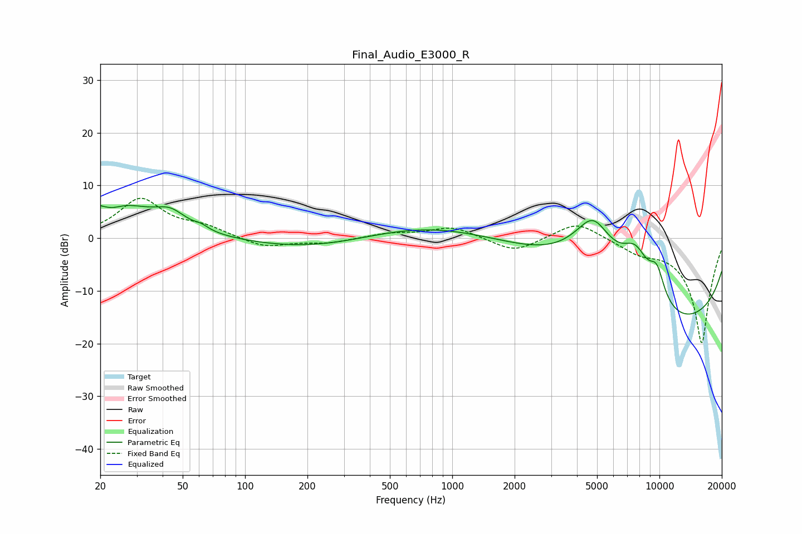

# Final_Audio_E3000_R
See [usage instructions](https://github.com/jaakkopasanen/AutoEq#usage) for more options and info.

### Parametric EQs
Apply preamp of -6.3 dB when using parametric equalizer.

|   # | Type    |   Fc (Hz) |    Q |   Gain (dB) |
|-----|---------|-----------|------|-------------|
|   1 | Peaking |        22 | 0.75 |         7.7 |
|   2 | Peaking |        22 | 2.49 |        -2.1 |
|   3 | Peaking |        44 | 1.93 |         2.8 |
|   4 | Peaking |        62 | 4.43 |         0.7 |
|   5 | Peaking |       283 | 0.41 |        -4.6 |
|   6 | Peaking |      1398 | 0.19 |         8.6 |
|   7 | Peaking |      4785 | 1.22 |        12.6 |
|   8 | Peaking |      7672 | 1.64 |         9.1 |
|   9 | Peaking |      8681 | 0.18 |       -20   |
|  10 | Peaking |      9716 | 3.29 |         5.5 |

### Fixed Band EQs
When using fixed band (also called graphic) equalizer, apply preamp of **-7.7 dB** (if available) and set gains manually with these parameters.

|   # | Type    |   Fc (Hz) |    Q |   Gain (dB) |
|-----|---------|-----------|------|-------------|
|   1 | Peaking |        31 | 1.41 |         7.3 |
|   2 | Peaking |        62 | 1.41 |         1.8 |
|   3 | Peaking |       125 | 1.41 |        -1.8 |
|   4 | Peaking |       250 | 1.41 |        -0.9 |
|   5 | Peaking |       500 | 1.41 |         0.9 |
|   6 | Peaking |      1000 | 1.41 |         2.2 |
|   7 | Peaking |      2000 | 1.41 |        -2.7 |
|   8 | Peaking |      4000 | 1.41 |         3.4 |
|   9 | Peaking |      8000 | 1.41 |        -2   |
|  10 | Peaking |     16000 | 1.41 |       -20   |

### Graphs

