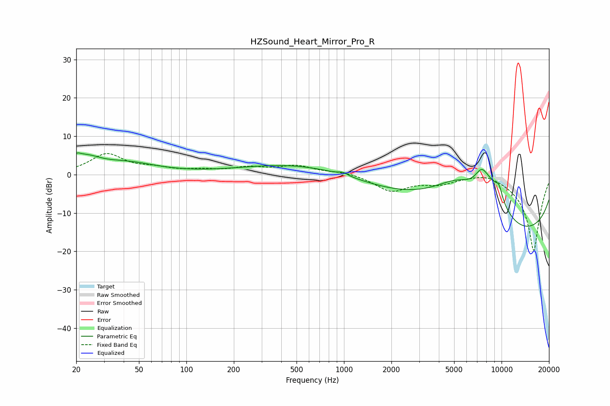

# HZSound_Heart_Mirror_Pro_R
See [usage instructions](https://github.com/jaakkopasanen/AutoEq#usage) for more options and info.

### Parametric EQs
Apply preamp of -5.8 dB when using parametric equalizer.

|   # | Type    |   Fc (Hz) |    Q |   Gain (dB) |
|-----|---------|-----------|------|-------------|
|   1 | Peaking |        20 | 5.07 |         1.8 |
|   2 | Peaking |        23 | 1.62 |         3.2 |
|   3 | Peaking |        42 | 0.74 |         2.8 |
|   4 | Peaking |       629 | 0.35 |         3.7 |
|   5 | Peaking |       987 | 4.83 |         0.7 |
|   6 | Peaking |      5283 | 0.65 |        12.4 |
|   7 | Peaking |      7476 | 3.08 |         4.7 |
|   8 | Peaking |      8767 | 1.46 |         7.2 |
|   9 | Peaking |      9543 | 0.18 |       -18.8 |
|  10 | Peaking |      9631 | 5.85 |         2.8 |

### Fixed Band EQs
When using fixed band (also called graphic) equalizer, apply preamp of **-5.6 dB** (if available) and set gains manually with these parameters.

|   # | Type    |   Fc (Hz) |    Q |   Gain (dB) |
|-----|---------|-----------|------|-------------|
|   1 | Peaking |        31 | 1.41 |         5.2 |
|   2 | Peaking |        62 | 1.41 |         1.3 |
|   3 | Peaking |       125 | 1.41 |         0.9 |
|   4 | Peaking |       250 | 1.41 |         1.6 |
|   5 | Peaking |       500 | 1.41 |         2.1 |
|   6 | Peaking |      1000 | 1.41 |         0.8 |
|   7 | Peaking |      2000 | 1.41 |        -4.2 |
|   8 | Peaking |      4000 | 1.41 |        -1.9 |
|   9 | Peaking |      8000 | 1.41 |         1.3 |
|  10 | Peaking |     16000 | 1.41 |       -20   |

### Graphs

