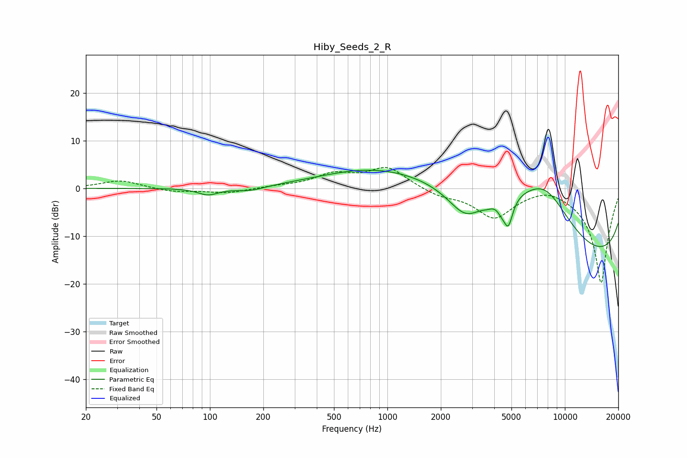

# Hiby_Seeds_2_R
See [usage instructions](https://github.com/jaakkopasanen/AutoEq#usage) for more options and info.

### Parametric EQs
Apply preamp of -3.9 dB when using parametric equalizer.

|   # | Type    |   Fc (Hz) |    Q |   Gain (dB) |
|-----|---------|-----------|------|-------------|
|   1 | Peaking |        98 | 2.49 |        -1.4 |
|   2 | Peaking |       169 | 1.69 |        -0.9 |
|   3 | Peaking |       804 | 0.47 |         3.2 |
|   4 | Peaking |      2759 | 1.37 |        -6.4 |
|   5 | Peaking |      3099 | 0.3  |         9   |
|   6 | Peaking |      3653 | 4.77 |        -0.5 |
|   7 | Peaking |      4391 | 5.96 |        -1.4 |
|   8 | Peaking |      4797 | 5.38 |        -5.9 |
|   9 | Peaking |      7747 | 0.67 |        13.5 |
|  10 | Peaking |     10000 | 0.18 |       -20   |

### Fixed Band EQs
When using fixed band (also called graphic) equalizer, apply preamp of **-4.5 dB** (if available) and set gains manually with these parameters.

|   # | Type    |   Fc (Hz) |    Q |   Gain (dB) |
|-----|---------|-----------|------|-------------|
|   1 | Peaking |        31 | 1.41 |         1.7 |
|   2 | Peaking |        62 | 1.41 |        -0.7 |
|   3 | Peaking |       125 | 1.41 |        -1   |
|   4 | Peaking |       250 | 1.41 |         0.4 |
|   5 | Peaking |       500 | 1.41 |         2.7 |
|   6 | Peaking |      1000 | 1.41 |         4.3 |
|   7 | Peaking |      2000 | 1.41 |        -1.4 |
|   8 | Peaking |      4000 | 1.41 |        -5.9 |
|   9 | Peaking |      8000 | 1.41 |         1.2 |
|  10 | Peaking |     16000 | 1.41 |       -20   |

### Graphs

