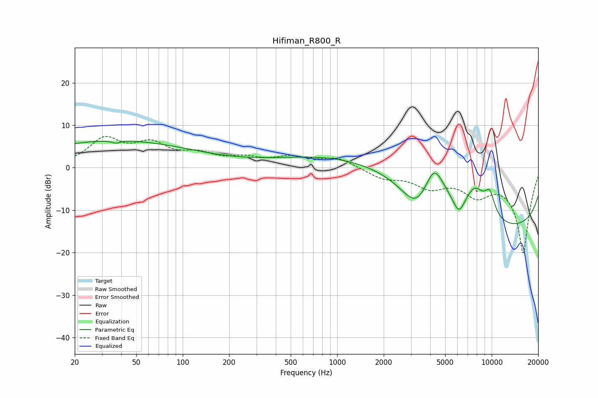

# Hifiman_R800_R
See [usage instructions](https://github.com/jaakkopasanen/AutoEq#usage) for more options and info.

### Parametric EQs
Apply preamp of -6.3 dB when using parametric equalizer.

|   # | Type    |   Fc (Hz) |    Q |   Gain (dB) |
|-----|---------|-----------|------|-------------|
|   1 | Peaking |        33 | 0.22 |        -0.5 |
|   2 | Peaking |        36 | 0.26 |         6.9 |
|   3 | Peaking |        37 | 5.8  |        -0.6 |
|   4 | Peaking |      3173 | 0.32 |        18.6 |
|   5 | Peaking |      3290 | 0.85 |       -16.1 |
|   6 | Peaking |      4236 | 1.99 |         9.6 |
|   7 | Peaking |      6141 | 3.6  |        -4.3 |
|   8 | Peaking |      7789 | 1.92 |         6.5 |
|   9 | Peaking |      9285 | 0.18 |       -20   |
|  10 | Peaking |      9713 | 3.67 |         5.2 |

### Fixed Band EQs
When using fixed band (also called graphic) equalizer, apply preamp of **-7.5 dB** (if available) and set gains manually with these parameters.

|   # | Type    |   Fc (Hz) |    Q |   Gain (dB) |
|-----|---------|-----------|------|-------------|
|   1 | Peaking |        31 | 1.41 |         6.3 |
|   2 | Peaking |        62 | 1.41 |         4.8 |
|   3 | Peaking |       125 | 1.41 |         2.6 |
|   4 | Peaking |       250 | 1.41 |         1.8 |
|   5 | Peaking |       500 | 1.41 |         2.1 |
|   6 | Peaking |      1000 | 1.41 |         2.3 |
|   7 | Peaking |      2000 | 1.41 |        -2.3 |
|   8 | Peaking |      4000 | 1.41 |        -4   |
|   9 | Peaking |      8000 | 1.41 |        -5.1 |
|  10 | Peaking |     16000 | 1.41 |       -20   |

### Graphs

