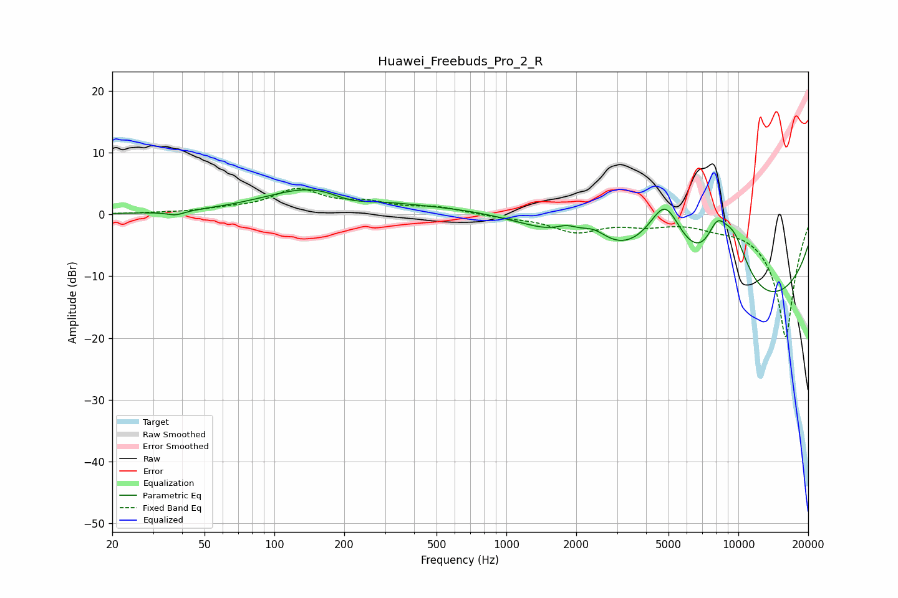

# Huawei_Freebuds_Pro_2_R
See [usage instructions](https://github.com/jaakkopasanen/AutoEq#usage) for more options and info.

### Parametric EQs
Apply preamp of -4.1 dB when using parametric equalizer.

|   # | Type    |   Fc (Hz) |    Q |   Gain (dB) |
|-----|---------|-----------|------|-------------|
|   1 | Peaking |        38 | 3.77 |        -0.7 |
|   2 | Peaking |       154 | 0.66 |         4.6 |
|   3 | Peaking |       211 | 1.44 |        -1.7 |
|   4 | Peaking |      1167 | 0.41 |         3.8 |
|   5 | Peaking |      1824 | 2.89 |         1.4 |
|   6 | Peaking |      2372 | 2.14 |         2.7 |
|   7 | Peaking |      4835 | 1.36 |        14.2 |
|   8 | Peaking |      8094 | 2.78 |         6   |
|   9 | Peaking |      8306 | 0.18 |       -17.9 |
|  10 | Peaking |      9542 | 1.65 |         9.7 |

### Fixed Band EQs
When using fixed band (also called graphic) equalizer, apply preamp of **-4.3 dB** (if available) and set gains manually with these parameters.

|   # | Type    |   Fc (Hz) |    Q |   Gain (dB) |
|-----|---------|-----------|------|-------------|
|   1 | Peaking |        31 | 1.41 |         0.1 |
|   2 | Peaking |        62 | 1.41 |         0.6 |
|   3 | Peaking |       125 | 1.41 |         3.8 |
|   4 | Peaking |       250 | 1.41 |         1.5 |
|   5 | Peaking |       500 | 1.41 |         1   |
|   6 | Peaking |      1000 | 1.41 |        -0.4 |
|   7 | Peaking |      2000 | 1.41 |        -2.6 |
|   8 | Peaking |      4000 | 1.41 |        -1.3 |
|   9 | Peaking |      8000 | 1.41 |        -1   |
|  10 | Peaking |     16000 | 1.41 |       -20   |

### Graphs

