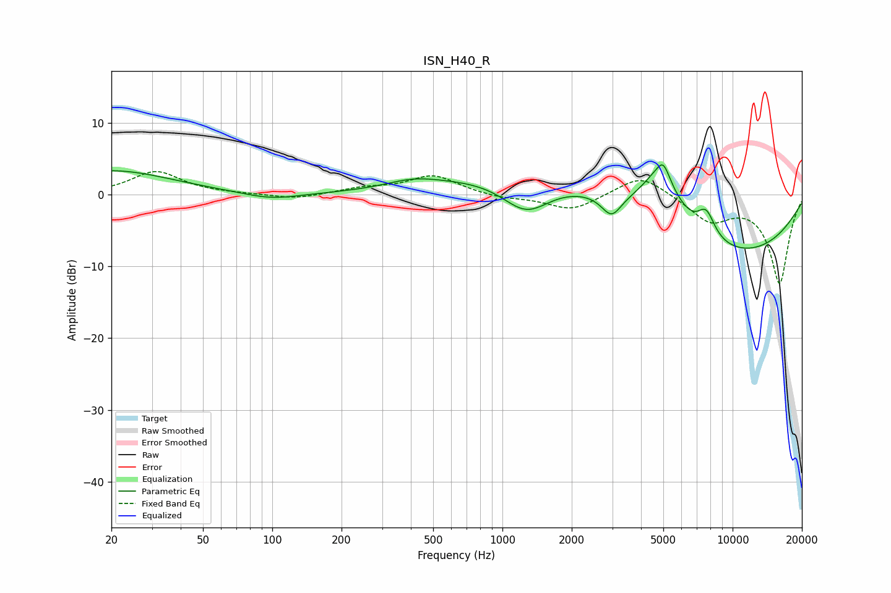

# ISN_H40_R
See [usage instructions](https://github.com/jaakkopasanen/AutoEq#usage) for more options and info.

### Parametric EQs
Apply preamp of -4.2 dB when using parametric equalizer.

|   # | Type    |   Fc (Hz) |    Q |   Gain (dB) |
|-----|---------|-----------|------|-------------|
|   1 | Peaking |        20 | 0.55 |         3.3 |
|   2 | Peaking |        99 | 1.16 |        -1   |
|   3 | Peaking |       410 | 1.22 |         1.1 |
|   4 | Peaking |      1268 | 1.3  |        -4.9 |
|   5 | Peaking |      1620 | 0.33 |         3.9 |
|   6 | Peaking |      2979 | 3.24 |        -3   |
|   7 | Peaking |      4858 | 1.65 |         7.1 |
|   8 | Peaking |      5002 | 5.64 |         1.9 |
|   9 | Peaking |      7675 | 3.44 |         3.6 |
|  10 | Peaking |      9464 | 0.31 |        -8.8 |

### Fixed Band EQs
When using fixed band (also called graphic) equalizer, apply preamp of **-3.3 dB** (if available) and set gains manually with these parameters.

|   # | Type    |   Fc (Hz) |    Q |   Gain (dB) |
|-----|---------|-----------|------|-------------|
|   1 | Peaking |        31 | 1.41 |         3.2 |
|   2 | Peaking |        62 | 1.41 |         0.1 |
|   3 | Peaking |       125 | 1.41 |        -0.7 |
|   4 | Peaking |       250 | 1.41 |         0.8 |
|   5 | Peaking |       500 | 1.41 |         2.6 |
|   6 | Peaking |      1000 | 1.41 |        -0.5 |
|   7 | Peaking |      2000 | 1.41 |        -2.2 |
|   8 | Peaking |      4000 | 1.41 |         3   |
|   9 | Peaking |      8000 | 1.41 |        -3.5 |
|  10 | Peaking |     16000 | 1.41 |       -12.3 |

### Graphs

