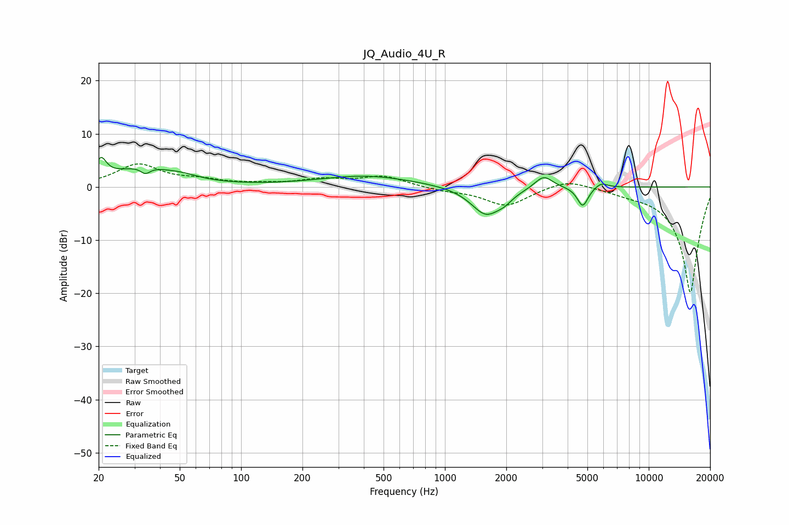

# JQ_Audio_4U_R
See [usage instructions](https://github.com/jaakkopasanen/AutoEq#usage) for more options and info.

### Parametric EQs
Apply preamp of -5.6 dB when using parametric equalizer.

|   # | Type    |   Fc (Hz) |    Q |   Gain (dB) |
|-----|---------|-----------|------|-------------|
|   1 | Peaking |        21 | 5.39 |         3.5 |
|   2 | Peaking |        33 | 0.89 |         3.5 |
|   3 | Peaking |        34 | 6    |        -1.3 |
|   4 | Peaking |        52 | 1.94 |         0.6 |
|   5 | Peaking |       409 | 0.61 |         2.1 |
|   6 | Peaking |      1591 | 1.9  |        -5.3 |
|   7 | Peaking |      1962 | 3.68 |        -1   |
|   8 | Peaking |      3050 | 3.19 |         2.5 |
|   9 | Peaking |      4743 | 5.28 |        -3.7 |
|  10 | Peaking |      5833 | 4.41 |         1   |

### Fixed Band EQs
When using fixed band (also called graphic) equalizer, apply preamp of **-4.4 dB** (if available) and set gains manually with these parameters.

|   # | Type    |   Fc (Hz) |    Q |   Gain (dB) |
|-----|---------|-----------|------|-------------|
|   1 | Peaking |        31 | 1.41 |         4.1 |
|   2 | Peaking |        62 | 1.41 |         1   |
|   3 | Peaking |       125 | 1.41 |         0.4 |
|   4 | Peaking |       250 | 1.41 |         1.3 |
|   5 | Peaking |       500 | 1.41 |         2   |
|   6 | Peaking |      1000 | 1.41 |        -0.6 |
|   7 | Peaking |      2000 | 1.41 |        -3.5 |
|   8 | Peaking |      4000 | 1.41 |         1.7 |
|   9 | Peaking |      8000 | 1.41 |        -0.7 |
|  10 | Peaking |     16000 | 1.41 |       -20   |

### Graphs

