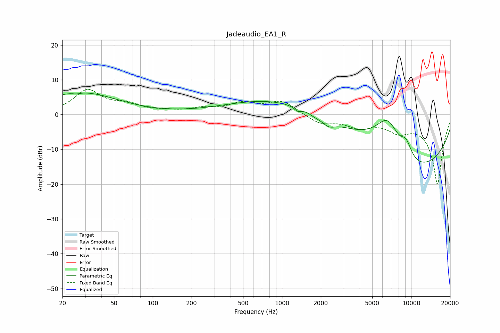

# Jadeaudio_EA1_R
See [usage instructions](https://github.com/jaakkopasanen/AutoEq#usage) for more options and info.

### Parametric EQs
Apply preamp of -6.3 dB when using parametric equalizer.

|   # | Type    |   Fc (Hz) |    Q |   Gain (dB) |
|-----|---------|-----------|------|-------------|
|   1 | Peaking |        20 | 0.9  |         1.6 |
|   2 | Peaking |        26 | 5.13 |        -0.4 |
|   3 | Peaking |        32 | 0.54 |         5.3 |
|   4 | Peaking |      1309 | 0.31 |         6.7 |
|   5 | Peaking |      1324 | 5.82 |        -1.1 |
|   6 | Peaking |      1799 | 3.69 |        -0.6 |
|   7 | Peaking |      2289 | 2.77 |        -2.1 |
|   8 | Peaking |      6598 | 1.08 |        14   |
|   9 | Peaking |      9004 | 0.27 |       -20   |
|  10 | Peaking |      9158 | 2.91 |         4.4 |

### Fixed Band EQs
When using fixed band (also called graphic) equalizer, apply preamp of **-7.3 dB** (if available) and set gains manually with these parameters.

|   # | Type    |   Fc (Hz) |    Q |   Gain (dB) |
|-----|---------|-----------|------|-------------|
|   1 | Peaking |        31 | 1.41 |         6.7 |
|   2 | Peaking |        62 | 1.41 |         2.3 |
|   3 | Peaking |       125 | 1.41 |         0.6 |
|   4 | Peaking |       250 | 1.41 |         1.5 |
|   5 | Peaking |       500 | 1.41 |         2.9 |
|   6 | Peaking |      1000 | 1.41 |         3.8 |
|   7 | Peaking |      2000 | 1.41 |        -2.6 |
|   8 | Peaking |      4000 | 1.41 |        -3.1 |
|   9 | Peaking |      8000 | 1.41 |        -3.6 |
|  10 | Peaking |     16000 | 1.41 |       -20   |

### Graphs

