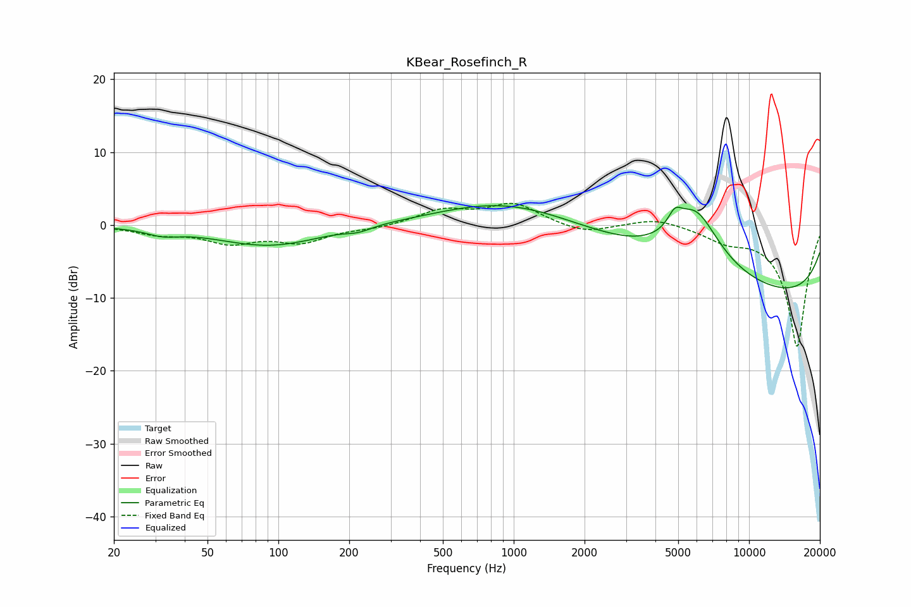

# KBear_Rosefinch_R
See [usage instructions](https://github.com/jaakkopasanen/AutoEq#usage) for more options and info.

### Parametric EQs
Apply preamp of -2.7 dB when using parametric equalizer.

|   # | Type    |   Fc (Hz) |    Q |   Gain (dB) |
|-----|---------|-----------|------|-------------|
|   1 | Peaking |        32 | 2.1  |        -0.8 |
|   2 | Peaking |        88 | 0.65 |        -2.6 |
|   3 | Peaking |       118 | 1.04 |        -0.3 |
|   4 | Peaking |       219 | 2.69 |        -0.6 |
|   5 | Peaking |       880 | 0.52 |         2.2 |
|   6 | Peaking |      3277 | 0.22 |         3.4 |
|   7 | Peaking |      4838 | 4.69 |         2.1 |
|   8 | Peaking |      5911 | 1.3  |         8.4 |
|   9 | Peaking |      8808 | 0.37 |        -0.1 |
|  10 | Peaking |     10000 | 0.18 |       -10.9 |

### Fixed Band EQs
When using fixed band (also called graphic) equalizer, apply preamp of **-3.1 dB** (if available) and set gains manually with these parameters.

|   # | Type    |   Fc (Hz) |    Q |   Gain (dB) |
|-----|---------|-----------|------|-------------|
|   1 | Peaking |        31 | 1.41 |        -1.1 |
|   2 | Peaking |        62 | 1.41 |        -2.2 |
|   3 | Peaking |       125 | 1.41 |        -2.2 |
|   4 | Peaking |       250 | 1.41 |        -0.4 |
|   5 | Peaking |       500 | 1.41 |         2   |
|   6 | Peaking |      1000 | 1.41 |         2.8 |
|   7 | Peaking |      2000 | 1.41 |        -1.2 |
|   8 | Peaking |      4000 | 1.41 |         1.1 |
|   9 | Peaking |      8000 | 1.41 |        -1.7 |
|  10 | Peaking |     16000 | 1.41 |       -16.7 |

### Graphs

