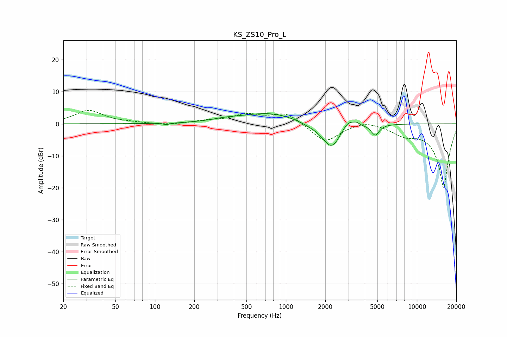

# KS_ZS10_Pro_L
See [usage instructions](https://github.com/jaakkopasanen/AutoEq#usage) for more options and info.

### Parametric EQs
Apply preamp of -3.3 dB when using parametric equalizer.

|   # | Type    |   Fc (Hz) |    Q |   Gain (dB) |
|-----|---------|-----------|------|-------------|
|   1 | Peaking |       122 | 6    |        -0.5 |
|   2 | Peaking |       347 | 1.29 |         0.8 |
|   3 | Peaking |       748 | 0.68 |         3.3 |
|   4 | Peaking |      1521 | 1.95 |        -0.8 |
|   5 | Peaking |      1835 | 5.02 |        -0.3 |
|   6 | Peaking |      2210 | 2.21 |        -7.4 |
|   7 | Peaking |      2444 | 6    |        -0.4 |
|   8 | Peaking |      3008 | 3.34 |         2.3 |
|   9 | Peaking |      3453 | 6    |         0.8 |
|  10 | Peaking |      4808 | 4.63 |        -3.4 |

### Fixed Band EQs
When using fixed band (also called graphic) equalizer, apply preamp of **-4.3 dB** (if available) and set gains manually with these parameters.

|   # | Type    |   Fc (Hz) |    Q |   Gain (dB) |
|-----|---------|-----------|------|-------------|
|   1 | Peaking |        31 | 1.41 |         4.1 |
|   2 | Peaking |        62 | 1.41 |         0.3 |
|   3 | Peaking |       125 | 1.41 |        -0.5 |
|   4 | Peaking |       250 | 1.41 |         0.8 |
|   5 | Peaking |       500 | 1.41 |         2.7 |
|   6 | Peaking |      1000 | 1.41 |         3.5 |
|   7 | Peaking |      2000 | 1.41 |        -5.9 |
|   8 | Peaking |      4000 | 1.41 |         1.4 |
|   9 | Peaking |      8000 | 1.41 |        -2.6 |
|  10 | Peaking |     16000 | 1.41 |       -20   |

### Graphs

