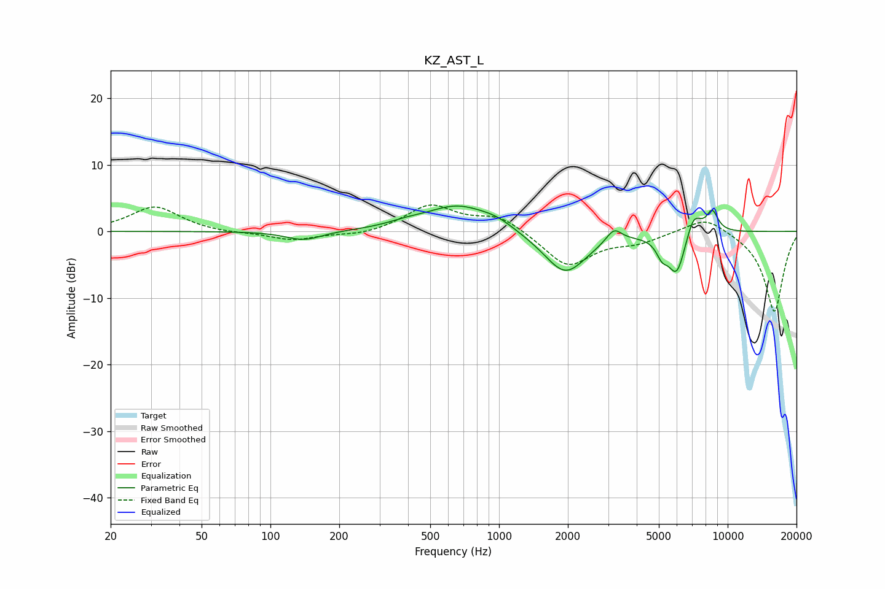

# KZ_AST_L
See [usage instructions](https://github.com/jaakkopasanen/AutoEq#usage) for more options and info.

### Parametric EQs
Apply preamp of -3.9 dB when using parametric equalizer.

|   # | Type    |   Fc (Hz) |    Q |   Gain (dB) |
|-----|---------|-----------|------|-------------|
|   1 | Peaking |       140 | 1.77 |        -1.4 |
|   2 | Peaking |       392 | 1.75 |         0.6 |
|   3 | Peaking |       658 | 1.02 |         3.8 |
|   4 | Peaking |       979 | 1.85 |         1.1 |
|   5 | Peaking |      1948 | 1.47 |        -6.5 |
|   6 | Peaking |      3180 | 4.16 |         2.1 |
|   7 | Peaking |      5161 | 5.7  |        -2.1 |
|   8 | Peaking |      5987 | 3.51 |        -6.4 |
|   9 | Peaking |      7096 | 3.92 |         3.6 |
|  10 | Peaking |      8561 | 5.03 |         3.1 |

### Fixed Band EQs
When using fixed band (also called graphic) equalizer, apply preamp of **-4.0 dB** (if available) and set gains manually with these parameters.

|   # | Type    |   Fc (Hz) |    Q |   Gain (dB) |
|-----|---------|-----------|------|-------------|
|   1 | Peaking |        31 | 1.41 |         3.7 |
|   2 | Peaking |        62 | 1.41 |        -0.3 |
|   3 | Peaking |       125 | 1.41 |        -1.3 |
|   4 | Peaking |       250 | 1.41 |        -0.6 |
|   5 | Peaking |       500 | 1.41 |         3.9 |
|   6 | Peaking |      1000 | 1.41 |         2.3 |
|   7 | Peaking |      2000 | 1.41 |        -5.3 |
|   8 | Peaking |      4000 | 1.41 |        -1.4 |
|   9 | Peaking |      8000 | 1.41 |         2.5 |
|  10 | Peaking |     16000 | 1.41 |       -12.2 |

### Graphs

