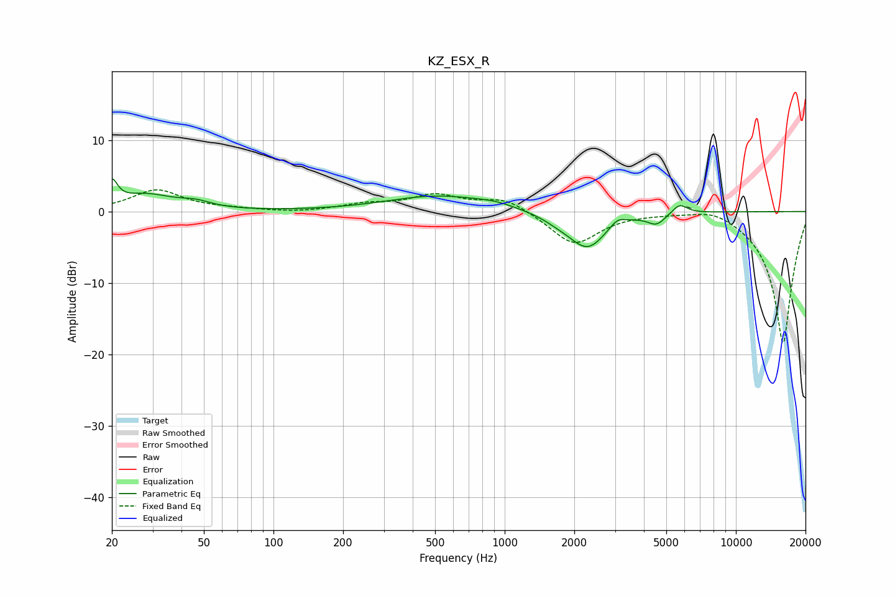

# KZ_ESX_R
See [usage instructions](https://github.com/jaakkopasanen/AutoEq#usage) for more options and info.

### Parametric EQs
Apply preamp of -4.7 dB when using parametric equalizer.

|   # | Type    |   Fc (Hz) |    Q |   Gain (dB) |
|-----|---------|-----------|------|-------------|
|   1 | Peaking |        20 | 5.99 |         3.1 |
|   2 | Peaking |        28 | 1.17 |         2.2 |
|   3 | Peaking |        46 | 2.12 |         0.8 |
|   4 | Peaking |       515 | 0.64 |         2.2 |
|   5 | Peaking |       909 | 1.69 |         0.5 |
|   6 | Peaking |      1707 | 1.97 |        -0.7 |
|   7 | Peaking |      2283 | 1.72 |        -5   |
|   8 | Peaking |      3071 | 4.12 |         1.1 |
|   9 | Peaking |      4536 | 3.64 |        -1.5 |
|  10 | Peaking |      5705 | 4.24 |         1.4 |

### Fixed Band EQs
When using fixed band (also called graphic) equalizer, apply preamp of **-3.1 dB** (if available) and set gains manually with these parameters.

|   # | Type    |   Fc (Hz) |    Q |   Gain (dB) |
|-----|---------|-----------|------|-------------|
|   1 | Peaking |        31 | 1.41 |         3   |
|   2 | Peaking |        62 | 1.41 |         0.3 |
|   3 | Peaking |       125 | 1.41 |        -0.2 |
|   4 | Peaking |       250 | 1.41 |         0.9 |
|   5 | Peaking |       500 | 1.41 |         2.1 |
|   6 | Peaking |      1000 | 1.41 |         1.9 |
|   7 | Peaking |      2000 | 1.41 |        -4.7 |
|   8 | Peaking |      4000 | 1.41 |        -0   |
|   9 | Peaking |      8000 | 1.41 |         1.1 |
|  10 | Peaking |     16000 | 1.41 |       -18.6 |

### Graphs

