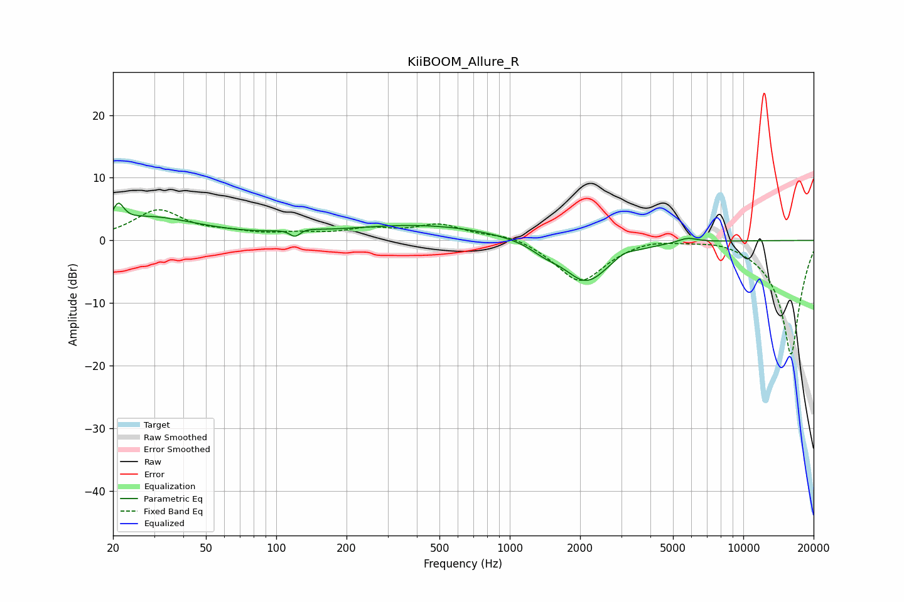

# KiiBOOM_Allure_R
See [usage instructions](https://github.com/jaakkopasanen/AutoEq#usage) for more options and info.

### Parametric EQs
Apply preamp of -6.1 dB when using parametric equalizer.

|   # | Type    |   Fc (Hz) |    Q |   Gain (dB) |
|-----|---------|-----------|------|-------------|
|   1 | Peaking |        21 | 5.93 |         3.2 |
|   2 | Peaking |        27 | 1.35 |         0.9 |
|   3 | Peaking |        32 | 0.66 |         2.8 |
|   4 | Peaking |       120 | 6    |        -1.5 |
|   5 | Peaking |       123 | 2.17 |         0.8 |
|   6 | Peaking |       421 | 0.41 |         2.5 |
|   7 | Peaking |      1409 | 2.36 |        -1   |
|   8 | Peaking |      2124 | 1.4  |        -6.8 |
|   9 | Peaking |      3074 | 3.57 |         0.7 |
|  10 | Peaking |      5774 | 3.24 |         0.8 |

### Fixed Band EQs
When using fixed band (also called graphic) equalizer, apply preamp of **-5.0 dB** (if available) and set gains manually with these parameters.

|   # | Type    |   Fc (Hz) |    Q |   Gain (dB) |
|-----|---------|-----------|------|-------------|
|   1 | Peaking |        31 | 1.41 |         4.7 |
|   2 | Peaking |        62 | 1.41 |         0.9 |
|   3 | Peaking |       125 | 1.41 |         0.8 |
|   4 | Peaking |       250 | 1.41 |         1.5 |
|   5 | Peaking |       500 | 1.41 |         2.3 |
|   6 | Peaking |      1000 | 1.41 |         1.1 |
|   7 | Peaking |      2000 | 1.41 |        -6.7 |
|   8 | Peaking |      4000 | 1.41 |         0.7 |
|   9 | Peaking |      8000 | 1.41 |         0.7 |
|  10 | Peaking |     16000 | 1.41 |       -18.4 |

### Graphs

