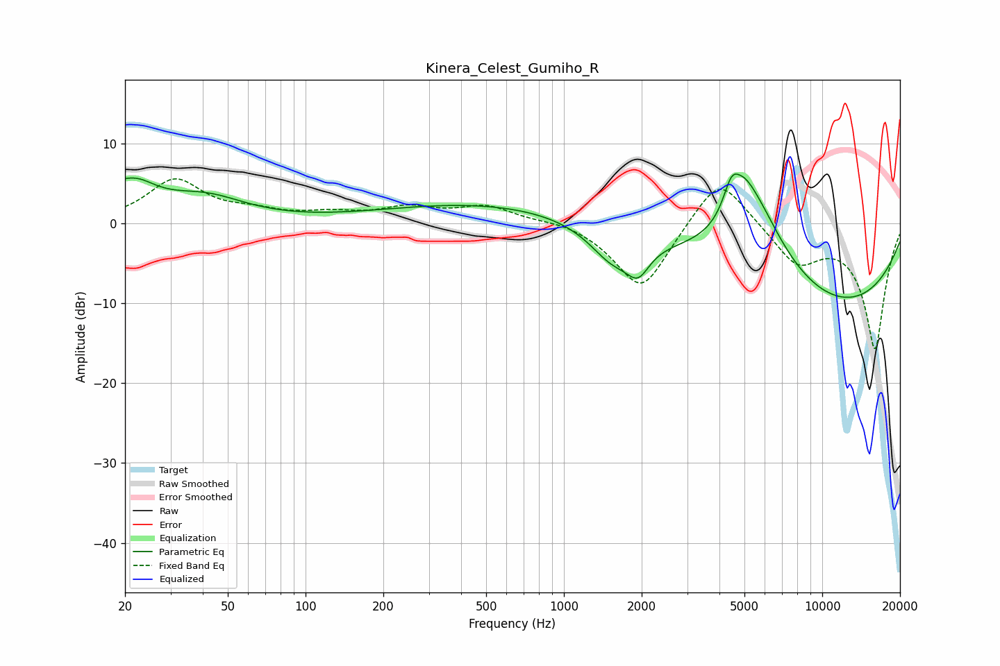

# Kinera_Celest_Gumiho_R
See [usage instructions](https://github.com/jaakkopasanen/AutoEq#usage) for more options and info.

### Parametric EQs
Apply preamp of -6.2 dB when using parametric equalizer.

|   # | Type    |   Fc (Hz) |    Q |   Gain (dB) |
|-----|---------|-----------|------|-------------|
|   1 | Peaking |        21 | 1.59 |         5.1 |
|   2 | Peaking |        21 | 3.58 |        -0.6 |
|   3 | Peaking |        41 | 0.91 |         2.9 |
|   4 | Peaking |       526 | 0.34 |         2.6 |
|   5 | Peaking |      1539 | 1.6  |        -3.9 |
|   6 | Peaking |      1937 | 3.22 |        -3.3 |
|   7 | Peaking |      4454 | 4.3  |         3.9 |
|   8 | Peaking |      4983 | 3.2  |         2.4 |
|   9 | Peaking |      5448 | 1.01 |        11.6 |
|  10 | Peaking |      9436 | 0.26 |       -11.8 |

### Fixed Band EQs
When using fixed band (also called graphic) equalizer, apply preamp of **-5.6 dB** (if available) and set gains manually with these parameters.

|   # | Type    |   Fc (Hz) |    Q |   Gain (dB) |
|-----|---------|-----------|------|-------------|
|   1 | Peaking |        31 | 1.41 |         5.3 |
|   2 | Peaking |        62 | 1.41 |         1.1 |
|   3 | Peaking |       125 | 1.41 |         1   |
|   4 | Peaking |       250 | 1.41 |         1.7 |
|   5 | Peaking |       500 | 1.41 |         2   |
|   6 | Peaking |      1000 | 1.41 |         0.6 |
|   7 | Peaking |      2000 | 1.41 |        -8.7 |
|   8 | Peaking |      4000 | 1.41 |         6.7 |
|   9 | Peaking |      8000 | 1.41 |        -4.7 |
|  10 | Peaking |     16000 | 1.41 |       -15.6 |

### Graphs

