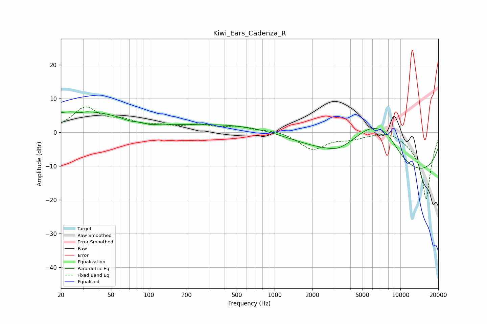

# Kiwi_Ears_Cadenza_R
See [usage instructions](https://github.com/jaakkopasanen/AutoEq#usage) for more options and info.

### Parametric EQs
Apply preamp of -6.2 dB when using parametric equalizer.

|   # | Type    |   Fc (Hz) |    Q |   Gain (dB) |
|-----|---------|-----------|------|-------------|
|   1 | Peaking |        28 | 5.89 |        -0.4 |
|   2 | Peaking |        28 | 0.35 |         6.3 |
|   3 | Peaking |        71 | 2.24 |        -0.8 |
|   4 | Peaking |       103 | 3.09 |        -0.7 |
|   5 | Peaking |       323 | 4.45 |        -0   |
|   6 | Peaking |       583 | 0.32 |         2.8 |
|   7 | Peaking |      3164 | 1.95 |        -0.9 |
|   8 | Peaking |      5515 | 0.8  |         9.8 |
|   9 | Peaking |      7630 | 1.08 |         7   |
|  10 | Peaking |      9257 | 0.18 |       -14.4 |

### Fixed Band EQs
When using fixed band (also called graphic) equalizer, apply preamp of **-7.7 dB** (if available) and set gains manually with these parameters.

|   # | Type    |   Fc (Hz) |    Q |   Gain (dB) |
|-----|---------|-----------|------|-------------|
|   1 | Peaking |        31 | 1.41 |         7   |
|   2 | Peaking |        62 | 1.41 |         2.7 |
|   3 | Peaking |       125 | 1.41 |         1.4 |
|   4 | Peaking |       250 | 1.41 |         1.9 |
|   5 | Peaking |       500 | 1.41 |         1.4 |
|   6 | Peaking |      1000 | 1.41 |         0.8 |
|   7 | Peaking |      2000 | 1.41 |        -4.9 |
|   8 | Peaking |      4000 | 1.41 |        -1.4 |
|   9 | Peaking |      8000 | 1.41 |         1.5 |
|  10 | Peaking |     16000 | 1.41 |       -20   |

### Graphs

