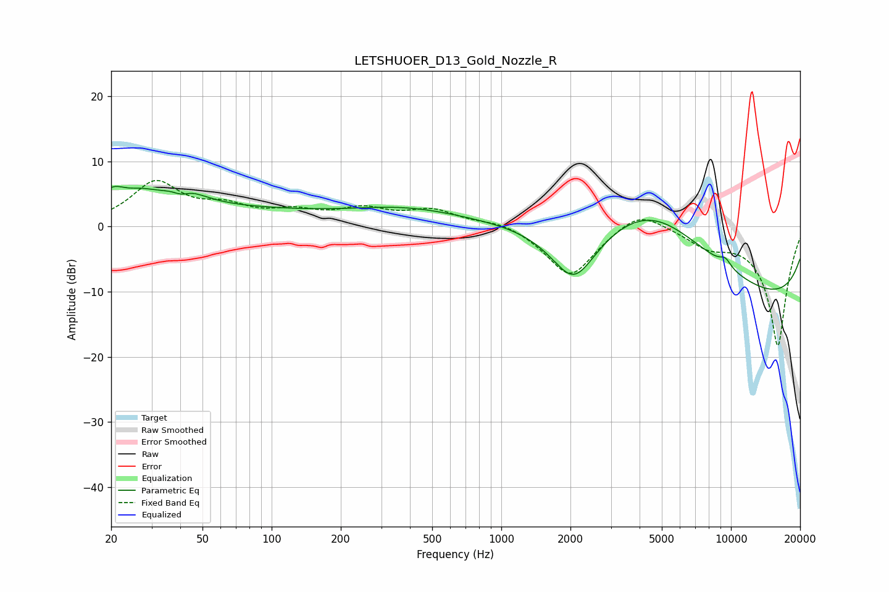

# LETSHUOER_D13_Gold_Nozzle_R
See [usage instructions](https://github.com/jaakkopasanen/AutoEq#usage) for more options and info.

### Parametric EQs
Apply preamp of -6.3 dB when using parametric equalizer.

|   # | Type    |   Fc (Hz) |    Q |   Gain (dB) |
|-----|---------|-----------|------|-------------|
|   1 | Peaking |        20 | 2.99 |         2.1 |
|   2 | Peaking |        27 | 1.82 |         1.7 |
|   3 | Peaking |        33 | 0.19 |         2.9 |
|   4 | Peaking |        40 | 4.09 |        -1.1 |
|   5 | Peaking |        41 | 1.67 |         2.5 |
|   6 | Peaking |       382 | 0.57 |         2.4 |
|   7 | Peaking |      2070 | 1.32 |        -9.6 |
|   8 | Peaking |      4516 | 0.4  |        14.4 |
|   9 | Peaking |      9455 | 5.03 |         1.2 |
|  10 | Peaking |      9920 | 0.18 |       -14.4 |

### Fixed Band EQs
When using fixed band (also called graphic) equalizer, apply preamp of **-7.2 dB** (if available) and set gains manually with these parameters.

|   # | Type    |   Fc (Hz) |    Q |   Gain (dB) |
|-----|---------|-----------|------|-------------|
|   1 | Peaking |        31 | 1.41 |         6.5 |
|   2 | Peaking |        62 | 1.41 |         2.4 |
|   3 | Peaking |       125 | 1.41 |         1.9 |
|   4 | Peaking |       250 | 1.41 |         2.3 |
|   5 | Peaking |       500 | 1.41 |         2.3 |
|   6 | Peaking |      1000 | 1.41 |         1   |
|   7 | Peaking |      2000 | 1.41 |        -7.8 |
|   8 | Peaking |      4000 | 1.41 |         3.1 |
|   9 | Peaking |      8000 | 1.41 |        -2.4 |
|  10 | Peaking |     16000 | 1.41 |       -18.3 |

### Graphs

