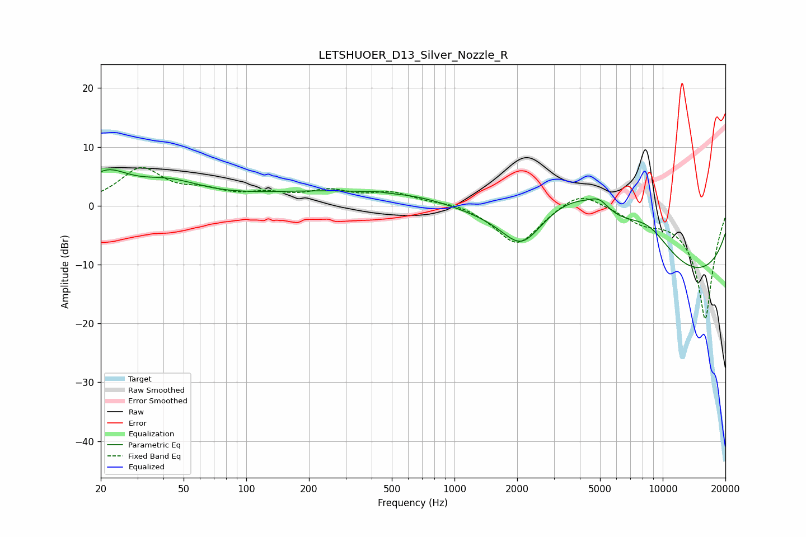

# LETSHUOER_D13_Silver_Nozzle_R
See [usage instructions](https://github.com/jaakkopasanen/AutoEq#usage) for more options and info.

### Parametric EQs
Apply preamp of -6.2 dB when using parametric equalizer.

|   # | Type    |   Fc (Hz) |    Q |   Gain (dB) |
|-----|---------|-----------|------|-------------|
|   1 | Peaking |        21 | 1.36 |         4.7 |
|   2 | Peaking |        42 | 0.87 |         3.3 |
|   3 | Peaking |       276 | 0.33 |         2.4 |
|   4 | Peaking |       417 | 5.86 |         0.2 |
|   5 | Peaking |       697 | 0.8  |         0.8 |
|   6 | Peaking |      2098 | 1.45 |        -6.2 |
|   7 | Peaking |      3834 | 0.58 |        11.7 |
|   8 | Peaking |      4947 | 3    |         1.9 |
|   9 | Peaking |      8457 | 0.98 |         6.3 |
|  10 | Peaking |      9330 | 0.18 |       -14.6 |

### Fixed Band EQs
When using fixed band (also called graphic) equalizer, apply preamp of **-6.6 dB** (if available) and set gains manually with these parameters.

|   # | Type    |   Fc (Hz) |    Q |   Gain (dB) |
|-----|---------|-----------|------|-------------|
|   1 | Peaking |        31 | 1.41 |         6.1 |
|   2 | Peaking |        62 | 1.41 |         1.9 |
|   3 | Peaking |       125 | 1.41 |         1.6 |
|   4 | Peaking |       250 | 1.41 |         2.2 |
|   5 | Peaking |       500 | 1.41 |         2   |
|   6 | Peaking |      1000 | 1.41 |         0.7 |
|   7 | Peaking |      2000 | 1.41 |        -6.8 |
|   8 | Peaking |      4000 | 1.41 |         3.1 |
|   9 | Peaking |      8000 | 1.41 |        -2   |
|  10 | Peaking |     16000 | 1.41 |       -19.3 |

### Graphs

