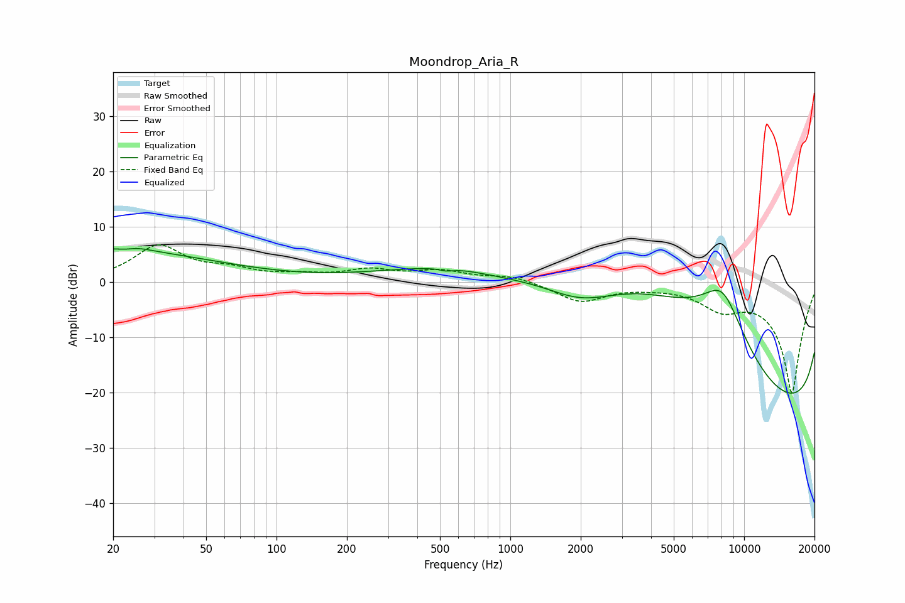

# Moondrop_Aria_R
See [usage instructions](https://github.com/jaakkopasanen/AutoEq#usage) for more options and info.

### Parametric EQs
Apply preamp of -6.2 dB when using parametric equalizer.

|   # | Type    |   Fc (Hz) |    Q |   Gain (dB) |
|-----|---------|-----------|------|-------------|
|   1 | Peaking |        20 | 0.3  |         5.5 |
|   2 | Peaking |        23 | 2.85 |        -1.9 |
|   3 | Peaking |        23 | 2.17 |         2.4 |
|   4 | Peaking |       532 | 5.64 |        -0.4 |
|   5 | Peaking |       918 | 0.8  |        -1.7 |
|   6 | Peaking |      1982 | 0.89 |        -4.2 |
|   7 | Peaking |      3727 | 0.22 |        20   |
|   8 | Peaking |      8083 | 0.76 |        20   |
|   9 | Peaking |     10000 | 0.18 |       -18.3 |
|  10 | Peaking |     10000 | 0.18 |       -19.7 |

### Fixed Band EQs
When using fixed band (also called graphic) equalizer, apply preamp of **-6.8 dB** (if available) and set gains manually with these parameters.

|   # | Type    |   Fc (Hz) |    Q |   Gain (dB) |
|-----|---------|-----------|------|-------------|
|   1 | Peaking |        31 | 1.41 |         6.3 |
|   2 | Peaking |        62 | 1.41 |         1.8 |
|   3 | Peaking |       125 | 1.41 |         0.9 |
|   4 | Peaking |       250 | 1.41 |         1.9 |
|   5 | Peaking |       500 | 1.41 |         1.8 |
|   6 | Peaking |      1000 | 1.41 |         1.2 |
|   7 | Peaking |      2000 | 1.41 |        -3.5 |
|   8 | Peaking |      4000 | 1.41 |        -0.4 |
|   9 | Peaking |      8000 | 1.41 |        -3.8 |
|  10 | Peaking |     16000 | 1.41 |       -20   |

### Graphs

