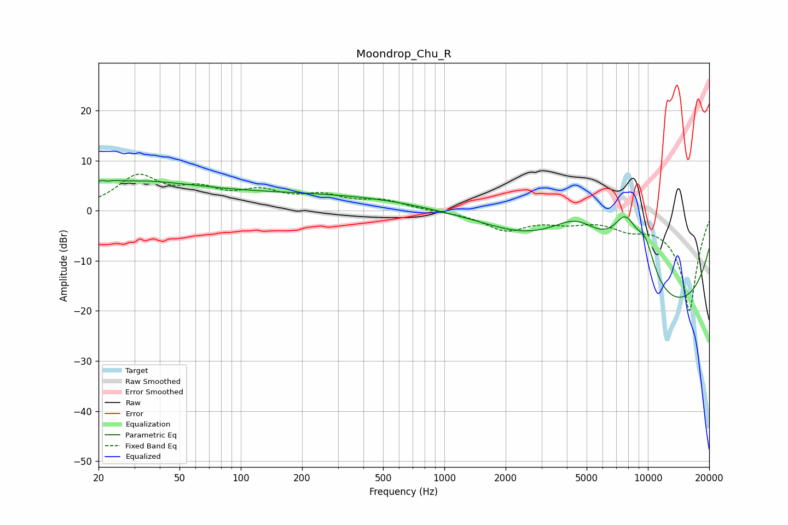

# Moondrop_Chu_R
See [usage instructions](https://github.com/jaakkopasanen/AutoEq#usage) for more options and info.

### Parametric EQs
Apply preamp of -6.1 dB when using parametric equalizer.

|   # | Type    |   Fc (Hz) |    Q |   Gain (dB) |
|-----|---------|-----------|------|-------------|
|   1 | Peaking |        21 | 3.92 |         2.3 |
|   2 | Peaking |        22 | 5.9  |        -1.4 |
|   3 | Peaking |        28 | 0.49 |         4.8 |
|   4 | Peaking |       256 | 0.18 |         3.4 |
|   5 | Peaking |      1458 | 0.73 |         1.3 |
|   6 | Peaking |      4477 | 0.68 |        14.2 |
|   7 | Peaking |      7554 | 0.19 |        -5.1 |
|   8 | Peaking |      7770 | 1.73 |        11.2 |
|   9 | Peaking |      9723 | 2.43 |         6.9 |
|  10 | Peaking |      9948 | 0.18 |       -17.8 |

### Fixed Band EQs
When using fixed band (also called graphic) equalizer, apply preamp of **-7.4 dB** (if available) and set gains manually with these parameters.

|   # | Type    |   Fc (Hz) |    Q |   Gain (dB) |
|-----|---------|-----------|------|-------------|
|   1 | Peaking |        31 | 1.41 |         6.5 |
|   2 | Peaking |        62 | 1.41 |         3.4 |
|   3 | Peaking |       125 | 1.41 |         3.2 |
|   4 | Peaking |       250 | 1.41 |         2.6 |
|   5 | Peaking |       500 | 1.41 |         1.8 |
|   6 | Peaking |      1000 | 1.41 |        -0.1 |
|   7 | Peaking |      2000 | 1.41 |        -3.7 |
|   8 | Peaking |      4000 | 1.41 |        -1.7 |
|   9 | Peaking |      8000 | 1.41 |        -2.4 |
|  10 | Peaking |     16000 | 1.41 |       -20   |

### Graphs

