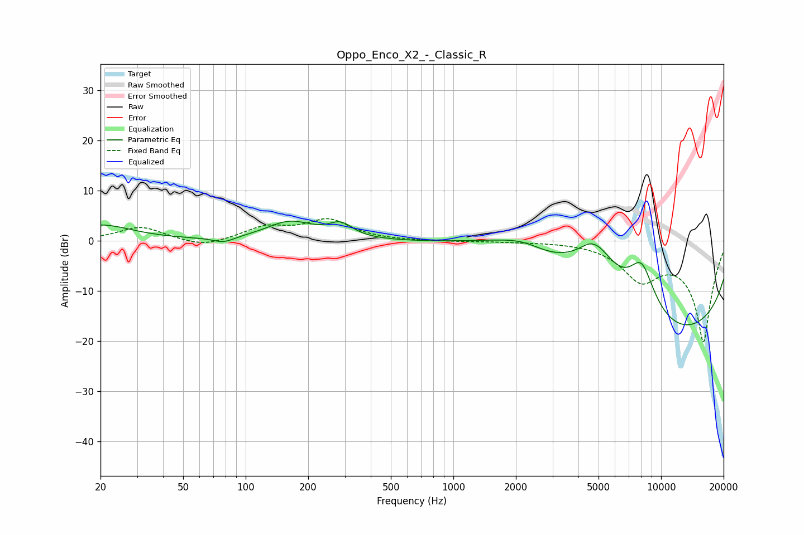

# Oppo_Enco_X2_-_Classic_R
See [usage instructions](https://github.com/jaakkopasanen/AutoEq#usage) for more options and info.

### Parametric EQs
Apply preamp of -4.0 dB when using parametric equalizer.

|   # | Type    |   Fc (Hz) |    Q |   Gain (dB) |
|-----|---------|-----------|------|-------------|
|   1 | Peaking |        20 | 0.93 |         3.1 |
|   2 | Peaking |        78 | 2.76 |        -1.1 |
|   3 | Peaking |       163 | 1.24 |         3.7 |
|   4 | Peaking |       287 | 2.47 |         2.7 |
|   5 | Peaking |      2325 | 0.66 |        14   |
|   6 | Peaking |      2470 | 0.97 |        -6.1 |
|   7 | Peaking |      4473 | 5.05 |         0.2 |
|   8 | Peaking |      4843 | 1.35 |         9.2 |
|   9 | Peaking |      8063 | 1.89 |        10.4 |
|  10 | Peaking |     10000 | 0.18 |       -20   |

### Fixed Band EQs
When using fixed band (also called graphic) equalizer, apply preamp of **-4.5 dB** (if available) and set gains manually with these parameters.

|   # | Type    |   Fc (Hz) |    Q |   Gain (dB) |
|-----|---------|-----------|------|-------------|
|   1 | Peaking |        31 | 1.41 |         2.8 |
|   2 | Peaking |        62 | 1.41 |        -1.4 |
|   3 | Peaking |       125 | 1.41 |         2.5 |
|   4 | Peaking |       250 | 1.41 |         4   |
|   5 | Peaking |       500 | 1.41 |        -0   |
|   6 | Peaking |      1000 | 1.41 |        -0.1 |
|   7 | Peaking |      2000 | 1.41 |        -0.1 |
|   8 | Peaking |      4000 | 1.41 |         0   |
|   9 | Peaking |      8000 | 1.41 |        -6.8 |
|  10 | Peaking |     16000 | 1.41 |       -20   |

### Graphs

