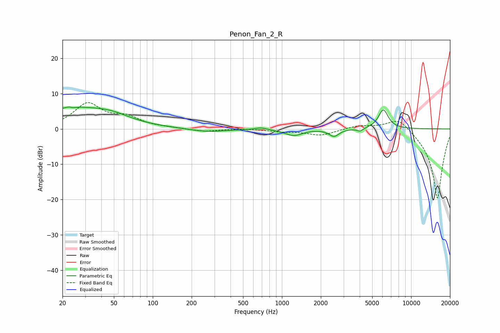

# Penon_Fan_2_R
See [usage instructions](https://github.com/jaakkopasanen/AutoEq#usage) for more options and info.

### Parametric EQs
Apply preamp of -6.3 dB when using parametric equalizer.

|   # | Type    |   Fc (Hz) |    Q |   Gain (dB) |
|-----|---------|-----------|------|-------------|
|   1 | Peaking |        23 | 5.89 |         3.3 |
|   2 | Peaking |        23 | 5.96 |        -3.2 |
|   3 | Peaking |        24 | 0.48 |         5.7 |
|   4 | Peaking |        48 | 1.05 |         1.5 |
|   5 | Peaking |       264 | 1.02 |        -0.9 |
|   6 | Peaking |       686 | 3.38 |         0.6 |
|   7 | Peaking |      1232 | 2.13 |        -1.8 |
|   8 | Peaking |      2533 | 3.7  |        -2   |
|   9 | Peaking |      4032 | 5.99 |        -0.9 |
|  10 | Peaking |      6093 | 3.6  |         5.4 |

### Fixed Band EQs
When using fixed band (also called graphic) equalizer, apply preamp of **-7.5 dB** (if available) and set gains manually with these parameters.

|   # | Type    |   Fc (Hz) |    Q |   Gain (dB) |
|-----|---------|-----------|------|-------------|
|   1 | Peaking |        31 | 1.41 |         6.9 |
|   2 | Peaking |        62 | 1.41 |         2.8 |
|   3 | Peaking |       125 | 1.41 |         0.2 |
|   4 | Peaking |       250 | 1.41 |        -0.8 |
|   5 | Peaking |       500 | 1.41 |         0.2 |
|   6 | Peaking |      1000 | 1.41 |        -0.7 |
|   7 | Peaking |      2000 | 1.41 |        -1.8 |
|   8 | Peaking |      4000 | 1.41 |         1   |
|   9 | Peaking |      8000 | 1.41 |         3.7 |
|  10 | Peaking |     16000 | 1.41 |       -20   |

### Graphs

