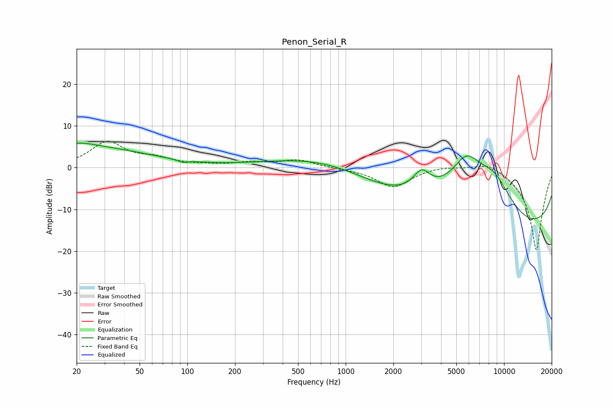

# Penon_Serial_R
See [usage instructions](https://github.com/jaakkopasanen/AutoEq#usage) for more options and info.

### Parametric EQs
Apply preamp of -6.0 dB when using parametric equalizer.

|   # | Type    |   Fc (Hz) |    Q |   Gain (dB) |
|-----|---------|-----------|------|-------------|
|   1 | Peaking |        20 | 1.41 |         1.7 |
|   2 | Peaking |        27 | 0.42 |         4.4 |
|   3 | Peaking |        94 | 5.15 |        -0.6 |
|   4 | Peaking |       231 | 4    |         0   |
|   5 | Peaking |      1851 | 0.55 |        -4.2 |
|   6 | Peaking |      2486 | 0.18 |         7.1 |
|   7 | Peaking |      3018 | 2.71 |         4.6 |
|   8 | Peaking |      5789 | 1.38 |         9.3 |
|   9 | Peaking |      8659 | 0.98 |         9.7 |
|  10 | Peaking |      9862 | 0.18 |       -18.6 |

### Fixed Band EQs
When using fixed band (also called graphic) equalizer, apply preamp of **-6.4 dB** (if available) and set gains manually with these parameters.

|   # | Type    |   Fc (Hz) |    Q |   Gain (dB) |
|-----|---------|-----------|------|-------------|
|   1 | Peaking |        31 | 1.41 |         6   |
|   2 | Peaking |        62 | 1.41 |         1.8 |
|   3 | Peaking |       125 | 1.41 |         0.4 |
|   4 | Peaking |       250 | 1.41 |         1   |
|   5 | Peaking |       500 | 1.41 |         1.8 |
|   6 | Peaking |      1000 | 1.41 |        -0.2 |
|   7 | Peaking |      2000 | 1.41 |        -4.6 |
|   8 | Peaking |      4000 | 1.41 |         0.6 |
|   9 | Peaking |      8000 | 1.41 |         2   |
|  10 | Peaking |     16000 | 1.41 |       -20   |

### Graphs

