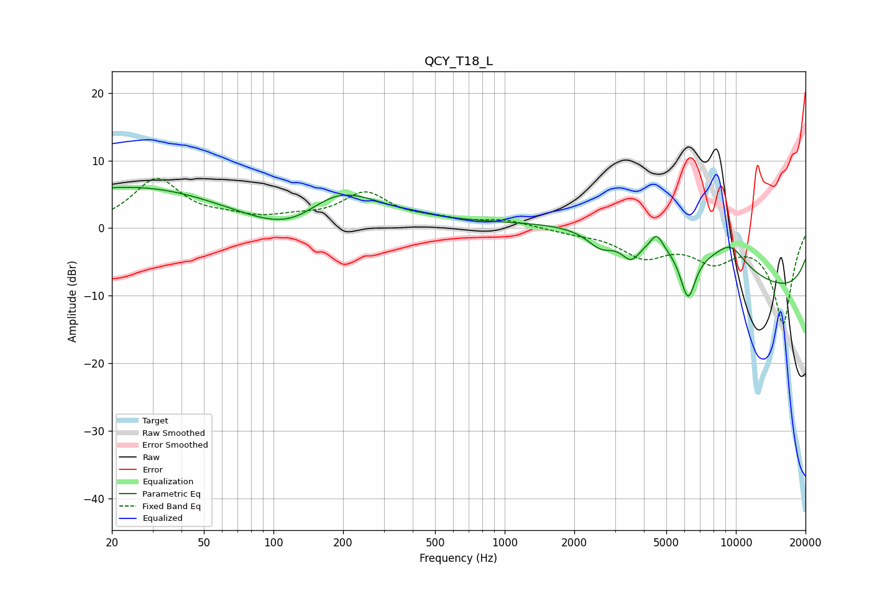

# QCY_T18_L
See [usage instructions](https://github.com/jaakkopasanen/AutoEq#usage) for more options and info.

### Parametric EQs
Apply preamp of -6.1 dB when using parametric equalizer.

|   # | Type    |   Fc (Hz) |    Q |   Gain (dB) |
|-----|---------|-----------|------|-------------|
|   1 | Peaking |        25 | 0.32 |         6.3 |
|   2 | Peaking |       128 | 0.66 |        -7.3 |
|   3 | Peaking |       182 | 0.69 |         9.4 |
|   4 | Peaking |      2607 | 2.34 |        -2.5 |
|   5 | Peaking |      3518 | 3.43 |        -3   |
|   6 | Peaking |      4546 | 5.43 |         2.2 |
|   7 | Peaking |      5234 | 0.26 |         9.9 |
|   8 | Peaking |      6207 | 4.03 |        -7.3 |
|   9 | Peaking |      9485 | 1.89 |         3.3 |
|  10 | Peaking |      9974 | 0.18 |       -14   |

### Fixed Band EQs
When using fixed band (also called graphic) equalizer, apply preamp of **-7.4 dB** (if available) and set gains manually with these parameters.

|   # | Type    |   Fc (Hz) |    Q |   Gain (dB) |
|-----|---------|-----------|------|-------------|
|   1 | Peaking |        31 | 1.41 |         7.1 |
|   2 | Peaking |        62 | 1.41 |         1   |
|   3 | Peaking |       125 | 1.41 |         1.1 |
|   4 | Peaking |       250 | 1.41 |         4.9 |
|   5 | Peaking |       500 | 1.41 |         0.9 |
|   6 | Peaking |      1000 | 1.41 |         1.1 |
|   7 | Peaking |      2000 | 1.41 |        -0.5 |
|   8 | Peaking |      4000 | 1.41 |        -3.8 |
|   9 | Peaking |      8000 | 1.41 |        -4.1 |
|  10 | Peaking |     16000 | 1.41 |       -14   |

### Graphs

