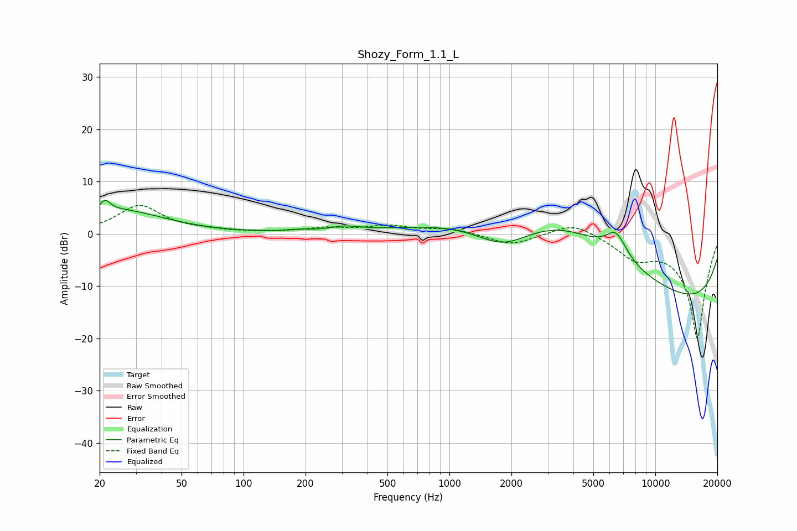

# Shozy_Form_1.1_L
See [usage instructions](https://github.com/jaakkopasanen/AutoEq#usage) for more options and info.

### Parametric EQs
Apply preamp of -6.5 dB when using parametric equalizer.

|   # | Type    |   Fc (Hz) |    Q |   Gain (dB) |
|-----|---------|-----------|------|-------------|
|   1 | Peaking |        21 | 5.51 |         2.3 |
|   2 | Peaking |        24 | 1.83 |         0.3 |
|   3 | Peaking |        26 | 0.66 |         4.2 |
|   4 | Peaking |       182 | 2.41 |         0.3 |
|   5 | Peaking |       310 | 1.92 |         0.9 |
|   6 | Peaking |      1819 | 1.04 |        -4.6 |
|   7 | Peaking |      3614 | 0.36 |        14.4 |
|   8 | Peaking |      6451 | 2.62 |         4.8 |
|   9 | Peaking |      8779 | 0.18 |        -9.1 |
|  10 | Peaking |     10000 | 0.18 |        -7   |

### Fixed Band EQs
When using fixed band (also called graphic) equalizer, apply preamp of **-5.5 dB** (if available) and set gains manually with these parameters.

|   # | Type    |   Fc (Hz) |    Q |   Gain (dB) |
|-----|---------|-----------|------|-------------|
|   1 | Peaking |        31 | 1.41 |         5.3 |
|   2 | Peaking |        62 | 1.41 |         0.4 |
|   3 | Peaking |       125 | 1.41 |         0.2 |
|   4 | Peaking |       250 | 1.41 |         1   |
|   5 | Peaking |       500 | 1.41 |         1.4 |
|   6 | Peaking |      1000 | 1.41 |         1   |
|   7 | Peaking |      2000 | 1.41 |        -2.2 |
|   8 | Peaking |      4000 | 1.41 |         2.4 |
|   9 | Peaking |      8000 | 1.41 |        -3.8 |
|  10 | Peaking |     16000 | 1.41 |       -20   |

### Graphs

