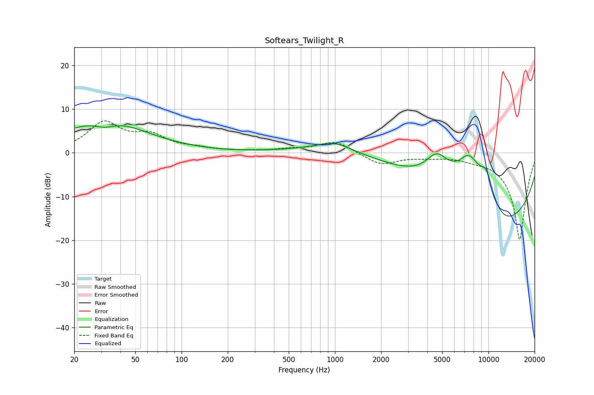

# Softears_Twilight_R
See [usage instructions](https://github.com/jaakkopasanen/AutoEq#usage) for more options and info.

### Parametric EQs
Apply preamp of -6.3 dB when using parametric equalizer.

|   # | Type    |   Fc (Hz) |    Q |   Gain (dB) |
|-----|---------|-----------|------|-------------|
|   1 | Peaking |        30 | 2.83 |         0.1 |
|   2 | Peaking |        31 | 1.91 |        -2.1 |
|   3 | Peaking |        31 | 0.55 |         7.9 |
|   4 | Peaking |       994 | 1.24 |         2.1 |
|   5 | Peaking |      3855 | 0.2  |         6   |
|   6 | Peaking |      4622 | 1.86 |         5.6 |
|   7 | Peaking |      7535 | 1.09 |        15.7 |
|   8 | Peaking |      9242 | 0.23 |       -19.8 |
|   9 | Peaking |      9732 | 2.38 |         7.6 |
|  10 | Peaking |      9934 | 0.53 |        -6.7 |

### Fixed Band EQs
When using fixed band (also called graphic) equalizer, apply preamp of **-7.4 dB** (if available) and set gains manually with these parameters.

|   # | Type    |   Fc (Hz) |    Q |   Gain (dB) |
|-----|---------|-----------|------|-------------|
|   1 | Peaking |        31 | 1.41 |         6.6 |
|   2 | Peaking |        62 | 1.41 |         3.4 |
|   3 | Peaking |       125 | 1.41 |         0.8 |
|   4 | Peaking |       250 | 1.41 |         0.2 |
|   5 | Peaking |       500 | 1.41 |         0.6 |
|   6 | Peaking |      1000 | 1.41 |         2.7 |
|   7 | Peaking |      2000 | 1.41 |        -2.7 |
|   8 | Peaking |      4000 | 1.41 |        -0.6 |
|   9 | Peaking |      8000 | 1.41 |        -0.7 |
|  10 | Peaking |     16000 | 1.41 |       -20   |

### Graphs

