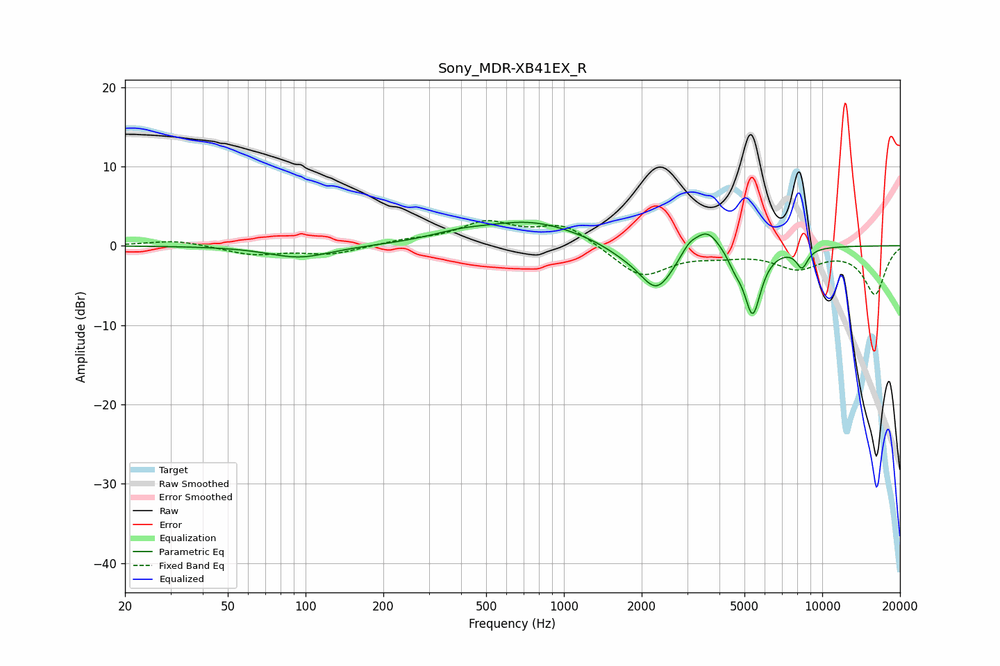

# Sony_MDR-XB41EX_R
See [usage instructions](https://github.com/jaakkopasanen/AutoEq#usage) for more options and info.

### Parametric EQs
Apply preamp of -3.1 dB when using parametric equalizer.

|   # | Type    |   Fc (Hz) |    Q |   Gain (dB) |
|-----|---------|-----------|------|-------------|
|   1 | Peaking |        95 | 1.17 |        -1.5 |
|   2 | Peaking |       390 | 1.26 |         0.8 |
|   3 | Peaking |       748 | 0.73 |         3   |
|   4 | Peaking |      1693 | 1.76 |        -0.8 |
|   5 | Peaking |      2286 | 2.05 |        -5.6 |
|   6 | Peaking |      3048 | 4.55 |         1.2 |
|   7 | Peaking |      3581 | 2.79 |         2.9 |
|   8 | Peaking |      4589 | 5.19 |        -1.3 |
|   9 | Peaking |      5377 | 4.14 |        -8.4 |
|  10 | Peaking |      8355 | 5.78 |        -2.4 |

### Fixed Band EQs
When using fixed band (also called graphic) equalizer, apply preamp of **-3.3 dB** (if available) and set gains manually with these parameters.

|   # | Type    |   Fc (Hz) |    Q |   Gain (dB) |
|-----|---------|-----------|------|-------------|
|   1 | Peaking |        31 | 1.41 |         0.7 |
|   2 | Peaking |        62 | 1.41 |        -1.1 |
|   3 | Peaking |       125 | 1.41 |        -1.1 |
|   4 | Peaking |       250 | 1.41 |         0.6 |
|   5 | Peaking |       500 | 1.41 |         2.8 |
|   6 | Peaking |      1000 | 1.41 |         2.7 |
|   7 | Peaking |      2000 | 1.41 |        -3.9 |
|   8 | Peaking |      4000 | 1.41 |        -0.8 |
|   9 | Peaking |      8000 | 1.41 |        -2.5 |
|  10 | Peaking |     16000 | 1.41 |        -6   |

### Graphs

