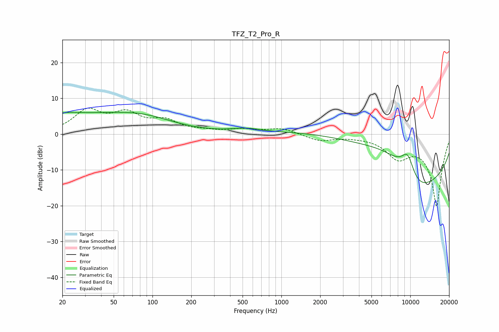

# TFZ_T2_Pro_R
See [usage instructions](https://github.com/jaakkopasanen/AutoEq#usage) for more options and info.

### Parametric EQs
Apply preamp of -6.2 dB when using parametric equalizer.

|   # | Type    |   Fc (Hz) |    Q |   Gain (dB) |
|-----|---------|-----------|------|-------------|
|   1 | Peaking |        20 | 2.24 |        -0.1 |
|   2 | Peaking |        20 | 1.6  |         1   |
|   3 | Peaking |        23 | 0.48 |         2.3 |
|   4 | Peaking |        33 | 0.31 |         2.3 |
|   5 | Peaking |        83 | 0.56 |         3.3 |
|   6 | Peaking |       531 | 1.24 |         1.1 |
|   7 | Peaking |      6874 | 0.31 |        19.1 |
|   8 | Peaking |      9558 | 1.94 |        10   |
|   9 | Peaking |     10000 | 0.54 |       -17.3 |
|  10 | Peaking |     10000 | 0.18 |       -15.8 |

### Fixed Band EQs
When using fixed band (also called graphic) equalizer, apply preamp of **-7.4 dB** (if available) and set gains manually with these parameters.

|   # | Type    |   Fc (Hz) |    Q |   Gain (dB) |
|-----|---------|-----------|------|-------------|
|   1 | Peaking |        31 | 1.41 |         6.2 |
|   2 | Peaking |        62 | 1.41 |         5   |
|   3 | Peaking |       125 | 1.41 |         3.2 |
|   4 | Peaking |       250 | 1.41 |         0.6 |
|   5 | Peaking |       500 | 1.41 |         1.1 |
|   6 | Peaking |      1000 | 1.41 |         1.6 |
|   7 | Peaking |      2000 | 1.41 |        -1.8 |
|   8 | Peaking |      4000 | 1.41 |        -0.3 |
|   9 | Peaking |      8000 | 1.41 |        -5.6 |
|  10 | Peaking |     16000 | 1.41 |       -20   |

### Graphs

