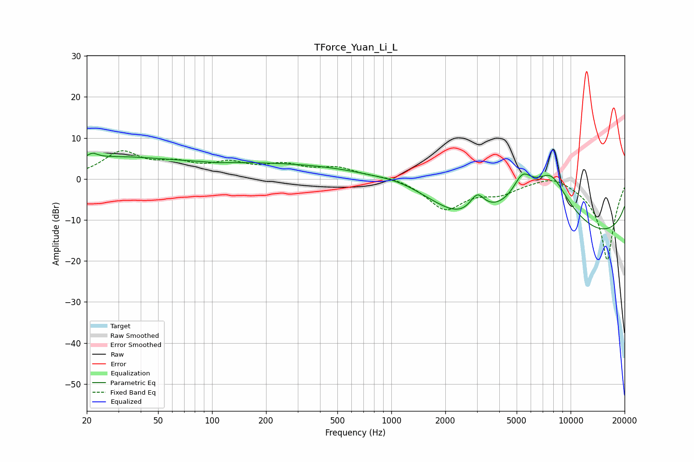

# TForce_Yuan_Li_L
See [usage instructions](https://github.com/jaakkopasanen/AutoEq#usage) for more options and info.

### Parametric EQs
Apply preamp of -6.4 dB when using parametric equalizer.

|   # | Type    |   Fc (Hz) |    Q |   Gain (dB) |
|-----|---------|-----------|------|-------------|
|   1 | Peaking |        22 | 4.96 |         1.2 |
|   2 | Peaking |        27 | 0.4  |         4.8 |
|   3 | Peaking |       107 | 3.1  |        -0.2 |
|   4 | Peaking |       314 | 0.23 |         3.8 |
|   5 | Peaking |      1135 | 1.13 |         1.3 |
|   6 | Peaking |      2390 | 1.11 |        -2.8 |
|   7 | Peaking |      3014 | 3.44 |         4.6 |
|   8 | Peaking |      5386 | 2.51 |         6.4 |
|   9 | Peaking |      7752 | 0.86 |        17.4 |
|  10 | Peaking |     10000 | 0.18 |       -18.4 |

### Fixed Band EQs
When using fixed band (also called graphic) equalizer, apply preamp of **-7.0 dB** (if available) and set gains manually with these parameters.

|   # | Type    |   Fc (Hz) |    Q |   Gain (dB) |
|-----|---------|-----------|------|-------------|
|   1 | Peaking |        31 | 1.41 |         6.2 |
|   2 | Peaking |        62 | 1.41 |         2.9 |
|   3 | Peaking |       125 | 1.41 |         3.2 |
|   4 | Peaking |       250 | 1.41 |         2.9 |
|   5 | Peaking |       500 | 1.41 |         2.4 |
|   6 | Peaking |      1000 | 1.41 |         0.8 |
|   7 | Peaking |      2000 | 1.41 |        -7.2 |
|   8 | Peaking |      4000 | 1.41 |        -2.9 |
|   9 | Peaking |      8000 | 1.41 |         2   |
|  10 | Peaking |     16000 | 1.41 |       -20   |

### Graphs

