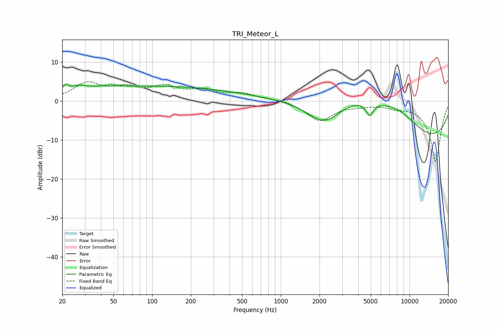

# TRI_Meteor_L
See [usage instructions](https://github.com/jaakkopasanen/AutoEq#usage) for more options and info.

### Parametric EQs
Apply preamp of -4.3 dB when using parametric equalizer.

|   # | Type    |   Fc (Hz) |    Q |   Gain (dB) |
|-----|---------|-----------|------|-------------|
|   1 | Peaking |        21 | 6    |         1.4 |
|   2 | Peaking |        27 | 2.43 |         1   |
|   3 | Peaking |        45 | 4.37 |        -2.6 |
|   4 | Peaking |        45 | 3.96 |         3   |
|   5 | Peaking |        93 | 0.18 |         3.8 |
|   6 | Peaking |      2204 | 0.92 |        -8.2 |
|   7 | Peaking |      3431 | 0.44 |         9.1 |
|   8 | Peaking |      4897 | 5.12 |        -3.3 |
|   9 | Peaking |      8313 | 0.59 |         8.3 |
|  10 | Peaking |     10000 | 0.25 |       -14.7 |

### Fixed Band EQs
When using fixed band (also called graphic) equalizer, apply preamp of **-5.1 dB** (if available) and set gains manually with these parameters.

|   # | Type    |   Fc (Hz) |    Q |   Gain (dB) |
|-----|---------|-----------|------|-------------|
|   1 | Peaking |        31 | 1.41 |         4.3 |
|   2 | Peaking |        62 | 1.41 |         2.7 |
|   3 | Peaking |       125 | 1.41 |         3.1 |
|   4 | Peaking |       250 | 1.41 |         2.4 |
|   5 | Peaking |       500 | 1.41 |         1.7 |
|   6 | Peaking |      1000 | 1.41 |         0.5 |
|   7 | Peaking |      2000 | 1.41 |        -4.9 |
|   8 | Peaking |      4000 | 1.41 |        -0.7 |
|   9 | Peaking |      8000 | 1.41 |        -1   |
|  10 | Peaking |     16000 | 1.41 |       -15.5 |

### Graphs

