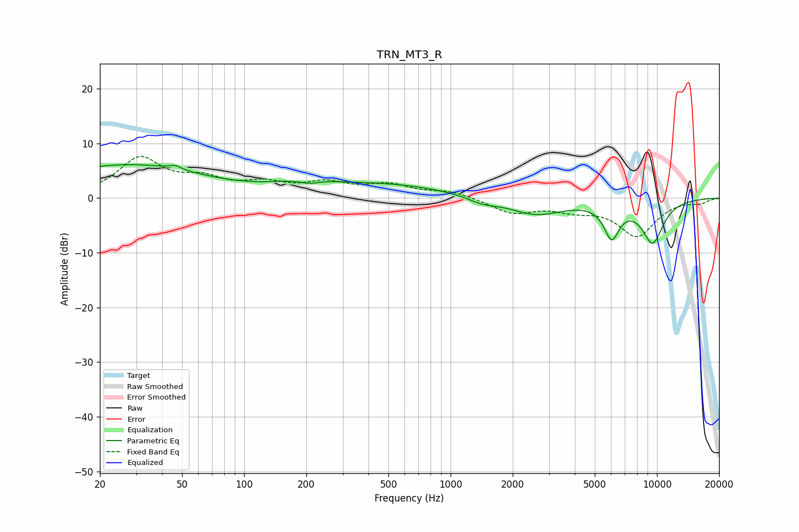

# TRN_MT3_R
See [usage instructions](https://github.com/jaakkopasanen/AutoEq#usage) for more options and info.

### Parametric EQs
Apply preamp of -6.2 dB when using parametric equalizer.

|   # | Type    |   Fc (Hz) |    Q |   Gain (dB) |
|-----|---------|-----------|------|-------------|
|   1 | Peaking |        20 | 0.33 |         4   |
|   2 | Peaking |        36 | 0.47 |         2.3 |
|   3 | Peaking |        46 | 5.11 |         0.7 |
|   4 | Peaking |       195 | 0.9  |         1.8 |
|   5 | Peaking |       207 | 2.76 |        -0.8 |
|   6 | Peaking |       511 | 0.48 |         2.3 |
|   7 | Peaking |      1421 | 2.14 |        -1   |
|   8 | Peaking |      2581 | 1.05 |        -3.1 |
|   9 | Peaking |      6031 | 3.66 |        -6.2 |
|  10 | Peaking |      9530 | 2.32 |        -7.8 |

### Fixed Band EQs
When using fixed band (also called graphic) equalizer, apply preamp of **-7.7 dB** (if available) and set gains manually with these parameters.

|   # | Type    |   Fc (Hz) |    Q |   Gain (dB) |
|-----|---------|-----------|------|-------------|
|   1 | Peaking |        31 | 1.41 |         7   |
|   2 | Peaking |        62 | 1.41 |         2.8 |
|   3 | Peaking |       125 | 1.41 |         2.2 |
|   4 | Peaking |       250 | 1.41 |         2.4 |
|   5 | Peaking |       500 | 1.41 |         2.2 |
|   6 | Peaking |      1000 | 1.41 |         1.2 |
|   7 | Peaking |      2000 | 1.41 |        -2.6 |
|   8 | Peaking |      4000 | 1.41 |        -1.7 |
|   9 | Peaking |      8000 | 1.41 |        -6.7 |
|  10 | Peaking |     16000 | 1.41 |        -0.8 |

### Graphs

