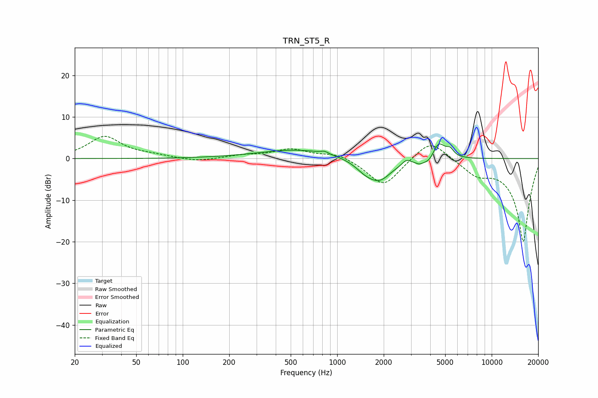

# TRN_ST5_R
See [usage instructions](https://github.com/jaakkopasanen/AutoEq#usage) for more options and info.

### Parametric EQs
Apply preamp of -3.6 dB when using parametric equalizer.

|   # | Type    |   Fc (Hz) |    Q |   Gain (dB) |
|-----|---------|-----------|------|-------------|
|   1 | Peaking |       570 | 0.55 |         2.2 |
|   2 | Peaking |       828 | 6    |         0.6 |
|   3 | Peaking |      1499 | 2.39 |        -1.4 |
|   4 | Peaking |      1873 | 1.58 |        -5.4 |
|   5 | Peaking |      2219 | 3.82 |         0.3 |
|   6 | Peaking |      2791 | 5    |         1.2 |
|   7 | Peaking |      3403 | 6    |        -0.7 |
|   8 | Peaking |      3957 | 3.5  |        -1.8 |
|   9 | Peaking |      4520 | 3.33 |         4.5 |
|  10 | Peaking |      5379 | 6    |         1.6 |

### Fixed Band EQs
When using fixed band (also called graphic) equalizer, apply preamp of **-5.4 dB** (if available) and set gains manually with these parameters.

|   # | Type    |   Fc (Hz) |    Q |   Gain (dB) |
|-----|---------|-----------|------|-------------|
|   1 | Peaking |        31 | 1.41 |         5.2 |
|   2 | Peaking |        62 | 1.41 |         0.6 |
|   3 | Peaking |       125 | 1.41 |        -0.8 |
|   4 | Peaking |       250 | 1.41 |         0.7 |
|   5 | Peaking |       500 | 1.41 |         2.2 |
|   6 | Peaking |      1000 | 1.41 |         1.4 |
|   7 | Peaking |      2000 | 1.41 |        -6.8 |
|   8 | Peaking |      4000 | 1.41 |         5.1 |
|   9 | Peaking |      8000 | 1.41 |        -3.2 |
|  10 | Peaking |     16000 | 1.41 |       -20   |

### Graphs

