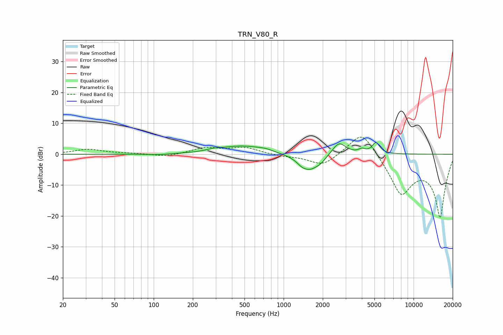

# TRN_V80_R
See [usage instructions](https://github.com/jaakkopasanen/AutoEq#usage) for more options and info.

### Parametric EQs
Apply preamp of -3.9 dB when using parametric equalizer.

|   # | Type    |   Fc (Hz) |    Q |   Gain (dB) |
|-----|---------|-----------|------|-------------|
|   1 | Peaking |       108 | 1.84 |        -0.3 |
|   2 | Peaking |       293 | 2.74 |         0.5 |
|   3 | Peaking |       481 | 0.83 |         2.7 |
|   4 | Peaking |       722 | 2.57 |         0.5 |
|   5 | Peaking |      1373 | 4.63 |        -0.7 |
|   6 | Peaking |      1582 | 1.82 |        -5.3 |
|   7 | Peaking |      1942 | 3.96 |        -1   |
|   8 | Peaking |      2667 | 2.69 |         4.3 |
|   9 | Peaking |      4002 | 5.67 |         1.1 |
|  10 | Peaking |      5135 | 4.82 |         3.6 |

### Fixed Band EQs
When using fixed band (also called graphic) equalizer, apply preamp of **-5.6 dB** (if available) and set gains manually with these parameters.

|   # | Type    |   Fc (Hz) |    Q |   Gain (dB) |
|-----|---------|-----------|------|-------------|
|   1 | Peaking |        31 | 1.41 |         1.6 |
|   2 | Peaking |        62 | 1.41 |         0.2 |
|   3 | Peaking |       125 | 1.41 |        -0.9 |
|   4 | Peaking |       250 | 1.41 |         2   |
|   5 | Peaking |       500 | 1.41 |         2.1 |
|   6 | Peaking |      1000 | 1.41 |        -0.6 |
|   7 | Peaking |      2000 | 1.41 |        -3.9 |
|   8 | Peaking |      4000 | 1.41 |         8.7 |
|   9 | Peaking |      8000 | 1.41 |       -12.4 |
|  10 | Peaking |     16000 | 1.41 |       -20   |

### Graphs

