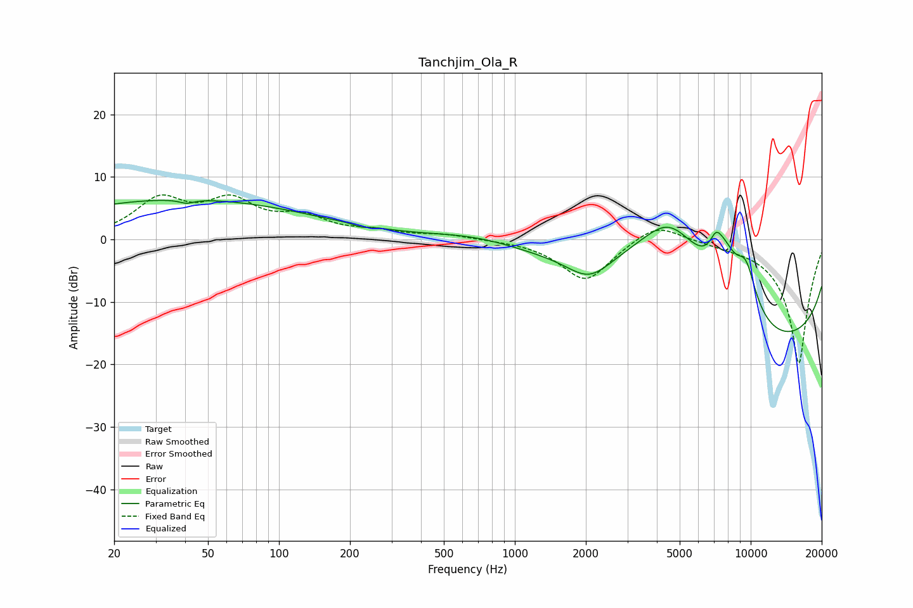

# Tanchjim_Ola_R
See [usage instructions](https://github.com/jaakkopasanen/AutoEq#usage) for more options and info.

### Parametric EQs
Apply preamp of -6.3 dB when using parametric equalizer.

|   # | Type    |   Fc (Hz) |    Q |   Gain (dB) |
|-----|---------|-----------|------|-------------|
|   1 | Peaking |        39 | 0.24 |         6.4 |
|   2 | Peaking |        41 | 4.75 |        -0.6 |
|   3 | Peaking |       222 | 5.75 |        -0.4 |
|   4 | Peaking |       691 | 0.73 |         1.6 |
|   5 | Peaking |      2068 | 1.51 |        -3.9 |
|   6 | Peaking |      4538 | 0.64 |        17.3 |
|   7 | Peaking |      7127 | 5.07 |         2.9 |
|   8 | Peaking |      7759 | 2.38 |         5.8 |
|   9 | Peaking |      9540 | 2.67 |         7.2 |
|  10 | Peaking |     10000 | 0.18 |       -20   |

### Fixed Band EQs
When using fixed band (also called graphic) equalizer, apply preamp of **-7.2 dB** (if available) and set gains manually with these parameters.

|   # | Type    |   Fc (Hz) |    Q |   Gain (dB) |
|-----|---------|-----------|------|-------------|
|   1 | Peaking |        31 | 1.41 |         5.9 |
|   2 | Peaking |        62 | 1.41 |         5.4 |
|   3 | Peaking |       125 | 1.41 |         3   |
|   4 | Peaking |       250 | 1.41 |         1   |
|   5 | Peaking |       500 | 1.41 |         0.7 |
|   6 | Peaking |      1000 | 1.41 |        -0   |
|   7 | Peaking |      2000 | 1.41 |        -6.7 |
|   8 | Peaking |      4000 | 1.41 |         3.1 |
|   9 | Peaking |      8000 | 1.41 |        -0.4 |
|  10 | Peaking |     16000 | 1.41 |       -20   |

### Graphs

