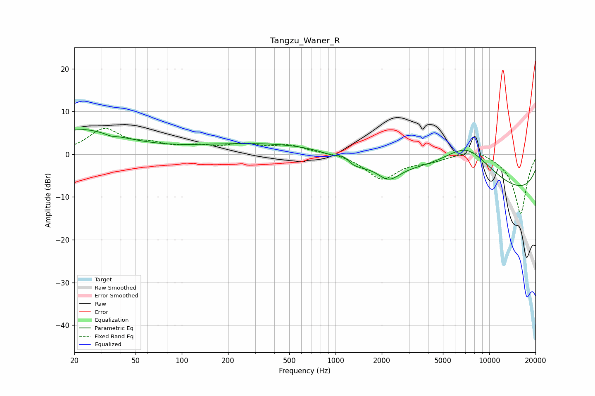

# Tangzu_Waner_R
See [usage instructions](https://github.com/jaakkopasanen/AutoEq#usage) for more options and info.

### Parametric EQs
Apply preamp of -6.0 dB when using parametric equalizer.

|   # | Type    |   Fc (Hz) |    Q |   Gain (dB) |
|-----|---------|-----------|------|-------------|
|   1 | Peaking |        20 | 0.48 |         5.8 |
|   2 | Peaking |        34 | 4.91 |         1.6 |
|   3 | Peaking |        34 | 4.8  |        -2.1 |
|   4 | Peaking |       590 | 0.18 |         2.9 |
|   5 | Peaking |      1132 | 3.14 |         2.2 |
|   6 | Peaking |      1228 | 1.43 |        -3.4 |
|   7 | Peaking |      2213 | 1.87 |        -3.8 |
|   8 | Peaking |      6882 | 1.64 |         0.2 |
|   9 | Peaking |      7103 | 0.66 |        10.9 |
|  10 | Peaking |     10000 | 0.18 |       -10.8 |

### Fixed Band EQs
When using fixed band (also called graphic) equalizer, apply preamp of **-6.1 dB** (if available) and set gains manually with these parameters.

|   # | Type    |   Fc (Hz) |    Q |   Gain (dB) |
|-----|---------|-----------|------|-------------|
|   1 | Peaking |        31 | 1.41 |         5.6 |
|   2 | Peaking |        62 | 1.41 |         1.8 |
|   3 | Peaking |       125 | 1.41 |         1.4 |
|   4 | Peaking |       250 | 1.41 |         1.9 |
|   5 | Peaking |       500 | 1.41 |         1.9 |
|   6 | Peaking |      1000 | 1.41 |         0.4 |
|   7 | Peaking |      2000 | 1.41 |        -5.7 |
|   8 | Peaking |      4000 | 1.41 |        -1.3 |
|   9 | Peaking |      8000 | 1.41 |         1.6 |
|  10 | Peaking |     16000 | 1.41 |       -14   |

### Graphs

