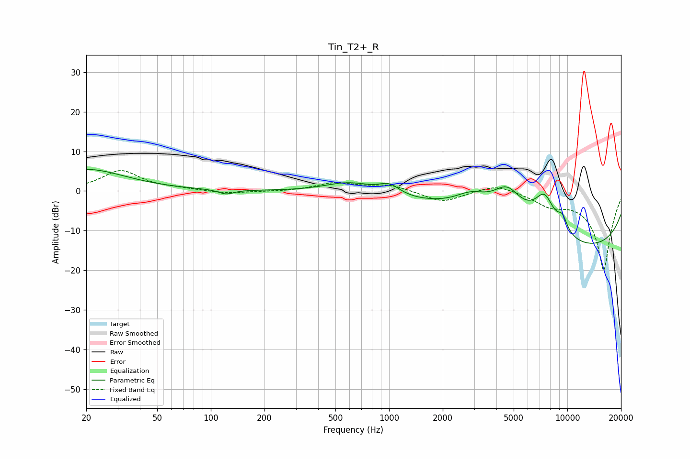

# Tin_T2+_R
See [usage instructions](https://github.com/jaakkopasanen/AutoEq#usage) for more options and info.

### Parametric EQs
Apply preamp of -5.5 dB when using parametric equalizer.

|   # | Type    |   Fc (Hz) |    Q |   Gain (dB) |
|-----|---------|-----------|------|-------------|
|   1 | Peaking |        20 | 0.64 |         5.4 |
|   2 | Peaking |       122 | 3.44 |        -1.2 |
|   3 | Peaking |       604 | 1    |         3.1 |
|   4 | Peaking |      1002 | 2.38 |         2.6 |
|   5 | Peaking |      2875 | 1.64 |         3   |
|   6 | Peaking |      4442 | 0.35 |         8.2 |
|   7 | Peaking |      4592 | 1.76 |         6.5 |
|   8 | Peaking |      7452 | 2.22 |         8.6 |
|   9 | Peaking |      8994 | 0.18 |       -18.5 |
|  10 | Peaking |      9386 | 4.5  |         3.4 |

### Fixed Band EQs
When using fixed band (also called graphic) equalizer, apply preamp of **-5.2 dB** (if available) and set gains manually with these parameters.

|   # | Type    |   Fc (Hz) |    Q |   Gain (dB) |
|-----|---------|-----------|------|-------------|
|   1 | Peaking |        31 | 1.41 |         5.1 |
|   2 | Peaking |        62 | 1.41 |         0.4 |
|   3 | Peaking |       125 | 1.41 |        -0.7 |
|   4 | Peaking |       250 | 1.41 |        -0.2 |
|   5 | Peaking |       500 | 1.41 |         2   |
|   6 | Peaking |      1000 | 1.41 |         1.5 |
|   7 | Peaking |      2000 | 1.41 |        -2.9 |
|   8 | Peaking |      4000 | 1.41 |         2   |
|   9 | Peaking |      8000 | 1.41 |        -2.8 |
|  10 | Peaking |     16000 | 1.41 |       -20   |

### Graphs

