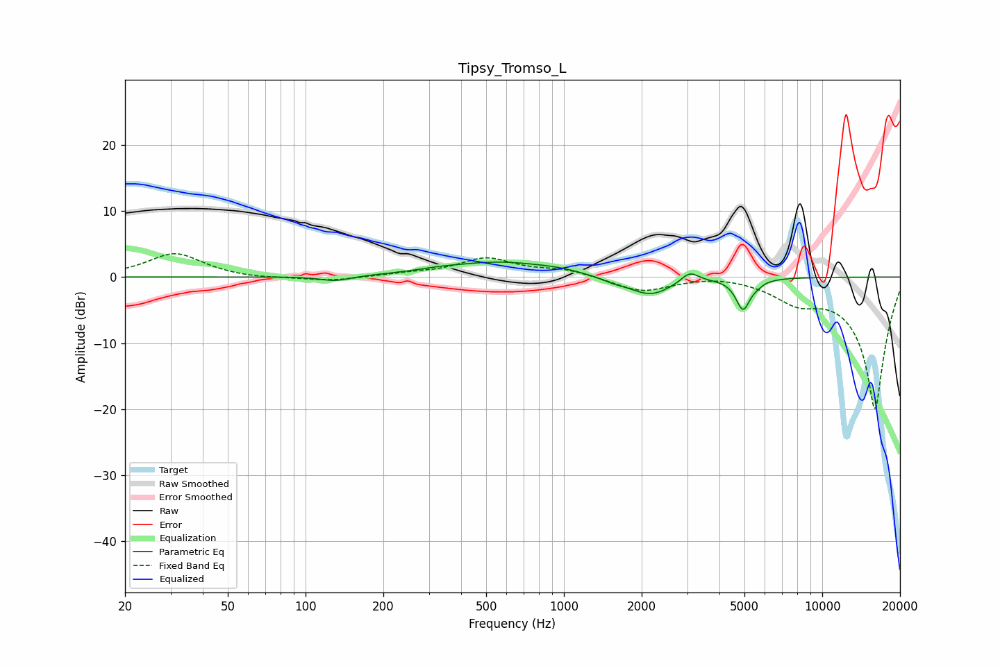

# Tipsy_Tromso_L
See [usage instructions](https://github.com/jaakkopasanen/AutoEq#usage) for more options and info.

### Parametric EQs
Apply preamp of -2.4 dB when using parametric equalizer.

|   # | Type    |   Fc (Hz) |    Q |   Gain (dB) |
|-----|---------|-----------|------|-------------|
|   1 | Peaking |       130 | 2.32 |        -0.8 |
|   2 | Peaking |       323 | 2.03 |         0.2 |
|   3 | Peaking |       560 | 0.67 |         2.3 |
|   4 | Peaking |       956 | 1.81 |         0.3 |
|   5 | Peaking |      1548 | 3.03 |        -0.5 |
|   6 | Peaking |      2159 | 1.66 |        -2.9 |
|   7 | Peaking |      3070 | 4.2  |         1.6 |
|   8 | Peaking |      4938 | 5.04 |        -4.7 |
|   9 | Peaking |      5405 | 5.01 |         0.2 |
|  10 | Peaking |      5586 | 6    |        -0.5 |

### Fixed Band EQs
When using fixed band (also called graphic) equalizer, apply preamp of **-3.6 dB** (if available) and set gains manually with these parameters.

|   # | Type    |   Fc (Hz) |    Q |   Gain (dB) |
|-----|---------|-----------|------|-------------|
|   1 | Peaking |        31 | 1.41 |         3.6 |
|   2 | Peaking |        62 | 1.41 |        -0.3 |
|   3 | Peaking |       125 | 1.41 |        -0.6 |
|   4 | Peaking |       250 | 1.41 |         0.4 |
|   5 | Peaking |       500 | 1.41 |         2.7 |
|   6 | Peaking |      1000 | 1.41 |         1.1 |
|   7 | Peaking |      2000 | 1.41 |        -2.2 |
|   8 | Peaking |      4000 | 1.41 |         0.5 |
|   9 | Peaking |      8000 | 1.41 |        -2.9 |
|  10 | Peaking |     16000 | 1.41 |       -20   |

### Graphs

