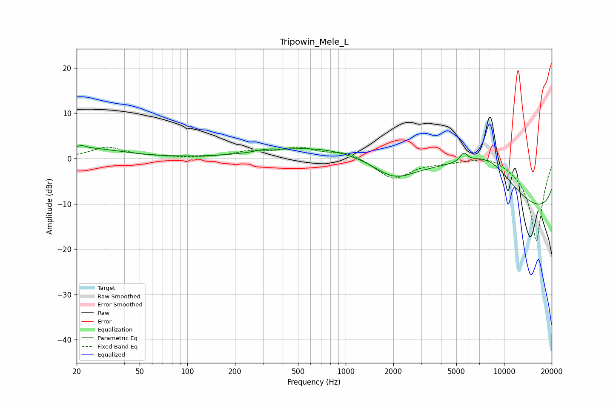

# Tripowin_Mele_L
See [usage instructions](https://github.com/jaakkopasanen/AutoEq#usage) for more options and info.

### Parametric EQs
Apply preamp of -3.0 dB when using parametric equalizer.

|   # | Type    |   Fc (Hz) |    Q |   Gain (dB) |
|-----|---------|-----------|------|-------------|
|   1 | Peaking |        21 | 5.25 |         0.7 |
|   2 | Peaking |        23 | 0.64 |         2.2 |
|   3 | Peaking |       312 | 5.27 |        -0.2 |
|   4 | Peaking |       313 | 2.74 |         0.8 |
|   5 | Peaking |       328 | 1.45 |        -0.3 |
|   6 | Peaking |      2014 | 1.1  |        -4   |
|   7 | Peaking |      2210 | 0.18 |         6.2 |
|   8 | Peaking |      5568 | 6    |         1.9 |
|   9 | Peaking |      8054 | 0.48 |        14.7 |
|  10 | Peaking |     10000 | 0.18 |       -19.8 |

### Fixed Band EQs
When using fixed band (also called graphic) equalizer, apply preamp of **-2.6 dB** (if available) and set gains manually with these parameters.

|   # | Type    |   Fc (Hz) |    Q |   Gain (dB) |
|-----|---------|-----------|------|-------------|
|   1 | Peaking |        31 | 1.41 |         2.4 |
|   2 | Peaking |        62 | 1.41 |         0.2 |
|   3 | Peaking |       125 | 1.41 |         0   |
|   4 | Peaking |       250 | 1.41 |         1.4 |
|   5 | Peaking |       500 | 1.41 |         2.2 |
|   6 | Peaking |      1000 | 1.41 |         1.5 |
|   7 | Peaking |      2000 | 1.41 |        -4.5 |
|   8 | Peaking |      4000 | 1.41 |        -0.6 |
|   9 | Peaking |      8000 | 1.41 |         1.3 |
|  10 | Peaking |     16000 | 1.41 |       -18.4 |

### Graphs

