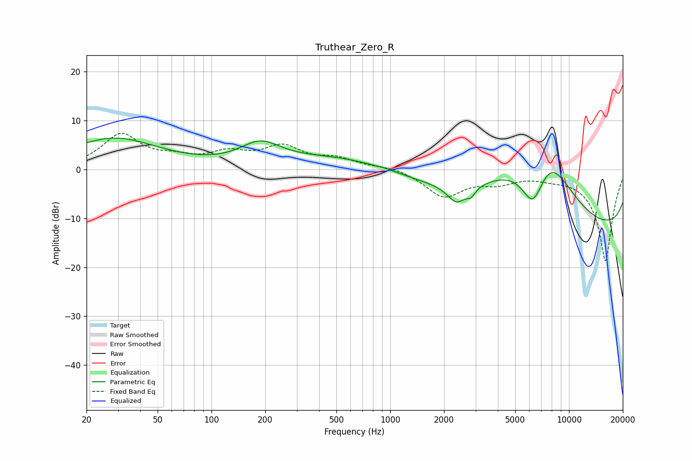

# Truthear_Zero_R
See [usage instructions](https://github.com/jaakkopasanen/AutoEq#usage) for more options and info.

### Parametric EQs
Apply preamp of -6.5 dB when using parametric equalizer.

|   # | Type    |   Fc (Hz) |    Q |   Gain (dB) |
|-----|---------|-----------|------|-------------|
|   1 | Peaking |        28 | 0.55 |         6.3 |
|   2 | Peaking |       188 | 1.26 |         4.3 |
|   3 | Peaking |       623 | 0.42 |         3.3 |
|   4 | Peaking |       924 | 4.53 |         0.1 |
|   5 | Peaking |      2351 | 2.82 |        -3.6 |
|   6 | Peaking |      2834 | 5.84 |        -1.5 |
|   7 | Peaking |      4905 | 0.69 |         4.8 |
|   8 | Peaking |      6294 | 2.06 |        -8.9 |
|   9 | Peaking |      7793 | 0.59 |        19.6 |
|  10 | Peaking |     10000 | 0.18 |       -19.9 |

### Fixed Band EQs
When using fixed band (also called graphic) equalizer, apply preamp of **-7.5 dB** (if available) and set gains manually with these parameters.

|   # | Type    |   Fc (Hz) |    Q |   Gain (dB) |
|-----|---------|-----------|------|-------------|
|   1 | Peaking |        31 | 1.41 |         7   |
|   2 | Peaking |        62 | 1.41 |         1.7 |
|   3 | Peaking |       125 | 1.41 |         2.9 |
|   4 | Peaking |       250 | 1.41 |         4.2 |
|   5 | Peaking |       500 | 1.41 |         1.9 |
|   6 | Peaking |      1000 | 1.41 |         0.7 |
|   7 | Peaking |      2000 | 1.41 |        -5.4 |
|   8 | Peaking |      4000 | 1.41 |        -2.1 |
|   9 | Peaking |      8000 | 1.41 |        -0.9 |
|  10 | Peaking |     16000 | 1.41 |       -18.8 |

### Graphs

