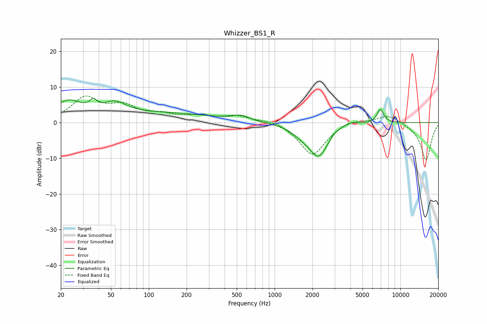

# Whizzer_BS1_R
See [usage instructions](https://github.com/jaakkopasanen/AutoEq#usage) for more options and info.

### Parametric EQs
Apply preamp of -6.9 dB when using parametric equalizer.

|   # | Type    |   Fc (Hz) |    Q |   Gain (dB) |
|-----|---------|-----------|------|-------------|
|   1 | Peaking |        23 | 1.49 |         3.9 |
|   2 | Peaking |        36 | 5.71 |         2   |
|   3 | Peaking |        54 | 1.69 |         2.8 |
|   4 | Peaking |        75 | 0.19 |         2.8 |
|   5 | Peaking |       541 | 2.37 |         1.3 |
|   6 | Peaking |      1614 | 1.99 |        -1.2 |
|   7 | Peaking |      2232 | 1.69 |        -9.4 |
|   8 | Peaking |      2961 | 3.88 |         1   |
|   9 | Peaking |      3893 | 2.1  |         1.5 |
|  10 | Peaking |      6917 | 4.93 |         3.9 |

### Fixed Band EQs
When using fixed band (also called graphic) equalizer, apply preamp of **-7.6 dB** (if available) and set gains manually with these parameters.

|   # | Type    |   Fc (Hz) |    Q |   Gain (dB) |
|-----|---------|-----------|------|-------------|
|   1 | Peaking |        31 | 1.41 |         6.6 |
|   2 | Peaking |        62 | 1.41 |         4   |
|   3 | Peaking |       125 | 1.41 |         1.8 |
|   4 | Peaking |       250 | 1.41 |         1.5 |
|   5 | Peaking |       500 | 1.41 |         1.8 |
|   6 | Peaking |      1000 | 1.41 |         1   |
|   7 | Peaking |      2000 | 1.41 |        -9.4 |
|   8 | Peaking |      4000 | 1.41 |         1.3 |
|   9 | Peaking |      8000 | 1.41 |         2.4 |
|  10 | Peaking |     16000 | 1.41 |       -10.6 |

### Graphs

