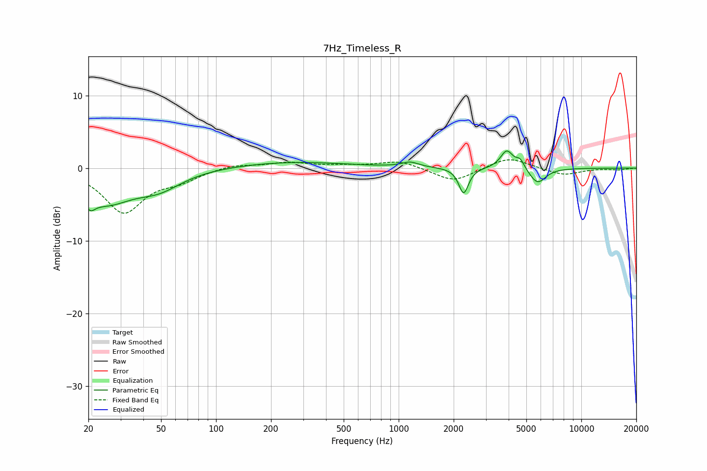

# 7Hz_Timeless_R
See [usage instructions](https://github.com/jaakkopasanen/AutoEq#usage) for more options and info.

### Parametric EQs
Apply preamp of -2.4 dB when using parametric equalizer.

|   # | Type    |   Fc (Hz) |    Q |   Gain (dB) |
|-----|---------|-----------|------|-------------|
|   1 | Peaking |        20 | 5.41 |        -5.1 |
|   2 | Peaking |        21 | 5.57 |         3.5 |
|   3 | Peaking |        25 | 0.96 |        -4.4 |
|   4 | Peaking |        49 | 1.14 |        -2.2 |
|   5 | Peaking |       257 | 0.46 |         0.9 |
|   6 | Peaking |      1155 | 3.04 |         0.7 |
|   7 | Peaking |      2269 | 5.44 |        -3.6 |
|   8 | Peaking |      3904 | 4.18 |         2.5 |
|   9 | Peaking |      4626 | 6    |         1.2 |
|  10 | Peaking |      5762 | 3.11 |        -2.2 |

### Fixed Band EQs
When using fixed band (also called graphic) equalizer, apply preamp of **-1.2 dB** (if available) and set gains manually with these parameters.

|   # | Type    |   Fc (Hz) |    Q |   Gain (dB) |
|-----|---------|-----------|------|-------------|
|   1 | Peaking |        31 | 1.41 |        -6   |
|   2 | Peaking |        62 | 1.41 |        -1.4 |
|   3 | Peaking |       125 | 1.41 |         0.6 |
|   4 | Peaking |       250 | 1.41 |         0.7 |
|   5 | Peaking |       500 | 1.41 |         0.3 |
|   6 | Peaking |      1000 | 1.41 |         1   |
|   7 | Peaking |      2000 | 1.41 |        -1.9 |
|   8 | Peaking |      4000 | 1.41 |         1.6 |
|   9 | Peaking |      8000 | 1.41 |        -1   |
|  10 | Peaking |     16000 | 1.41 |        -0.2 |

### Graphs

