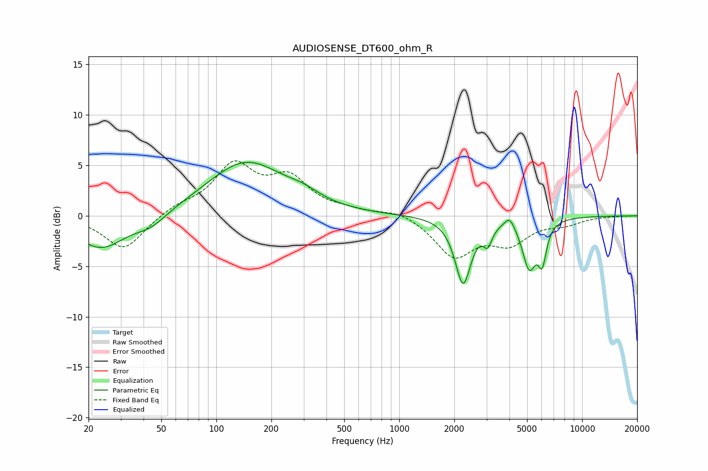

# AUDIOSENSE_DT600_ohm_R
See [usage instructions](https://github.com/jaakkopasanen/AutoEq#usage) for more options and info.

### Parametric EQs
Apply preamp of -5.4 dB when using parametric equalizer.

|   # | Type    |   Fc (Hz) |    Q |   Gain (dB) |
|-----|---------|-----------|------|-------------|
|   1 | Peaking |        20 | 4.67 |        -0.1 |
|   2 | Peaking |        24 | 1.09 |        -3.2 |
|   3 | Peaking |        44 | 1.61 |        -1.2 |
|   4 | Peaking |       145 | 0.67 |         5.3 |
|   5 | Peaking |       299 | 1.56 |         0.7 |
|   6 | Peaking |      2234 | 3.27 |        -6.5 |
|   7 | Peaking |      3045 | 5.95 |        -1.8 |
|   8 | Peaking |      4014 | 5.38 |         1.1 |
|   9 | Peaking |      5137 | 3.74 |        -4.7 |
|  10 | Peaking |      6054 | 6    |        -3.5 |

### Fixed Band EQs
When using fixed band (also called graphic) equalizer, apply preamp of **-5.5 dB** (if available) and set gains manually with these parameters.

|   # | Type    |   Fc (Hz) |    Q |   Gain (dB) |
|-----|---------|-----------|------|-------------|
|   1 | Peaking |        31 | 1.41 |        -3.4 |
|   2 | Peaking |        62 | 1.41 |         0.9 |
|   3 | Peaking |       125 | 1.41 |         4.8 |
|   4 | Peaking |       250 | 1.41 |         3.4 |
|   5 | Peaking |       500 | 1.41 |         0.4 |
|   6 | Peaking |      1000 | 1.41 |         0.6 |
|   7 | Peaking |      2000 | 1.41 |        -3.9 |
|   8 | Peaking |      4000 | 1.41 |        -2.4 |
|   9 | Peaking |      8000 | 1.41 |        -0.7 |
|  10 | Peaking |     16000 | 1.41 |        -0   |

### Graphs

