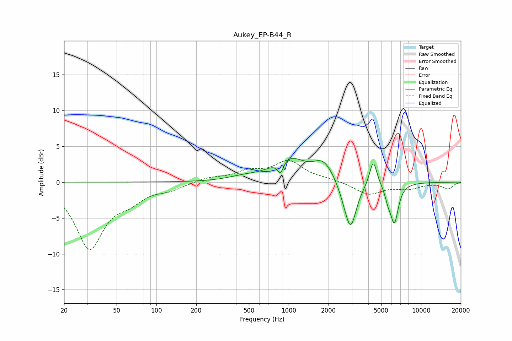

# Aukey_EP-B44_R
See [usage instructions](https://github.com/jaakkopasanen/AutoEq#usage) for more options and info.

### Parametric EQs
Apply preamp of -3.4 dB when using parametric equalizer.

|   # | Type    |   Fc (Hz) |    Q |   Gain (dB) |
|-----|---------|-----------|------|-------------|
|   1 | Peaking |       452 | 1.26 |         0.5 |
|   2 | Peaking |       867 | 6    |        -1.9 |
|   3 | Peaking |       998 | 1.19 |         3.3 |
|   4 | Peaking |      1814 | 1.94 |         2.3 |
|   5 | Peaking |      2167 | 1.58 |         0.5 |
|   6 | Peaking |      2646 | 2.55 |        -1.3 |
|   7 | Peaking |      2941 | 3.2  |        -6.1 |
|   8 | Peaking |      4358 | 5.03 |         3.6 |
|   9 | Peaking |      5638 | 6    |        -1.4 |
|  10 | Peaking |      6296 | 4.57 |        -5.4 |

### Fixed Band EQs
When using fixed band (also called graphic) equalizer, apply preamp of **-3.2 dB** (if available) and set gains manually with these parameters.

|   # | Type    |   Fc (Hz) |    Q |   Gain (dB) |
|-----|---------|-----------|------|-------------|
|   1 | Peaking |        31 | 1.41 |        -9   |
|   2 | Peaking |        62 | 1.41 |        -1.9 |
|   3 | Peaking |       125 | 1.41 |        -0.8 |
|   4 | Peaking |       250 | 1.41 |         0.6 |
|   5 | Peaking |       500 | 1.41 |         1.3 |
|   6 | Peaking |      1000 | 1.41 |         2.8 |
|   7 | Peaking |      2000 | 1.41 |         0.3 |
|   8 | Peaking |      4000 | 1.41 |        -1.7 |
|   9 | Peaking |      8000 | 1.41 |        -0.8 |
|  10 | Peaking |     16000 | 1.41 |        -0.9 |

### Graphs

