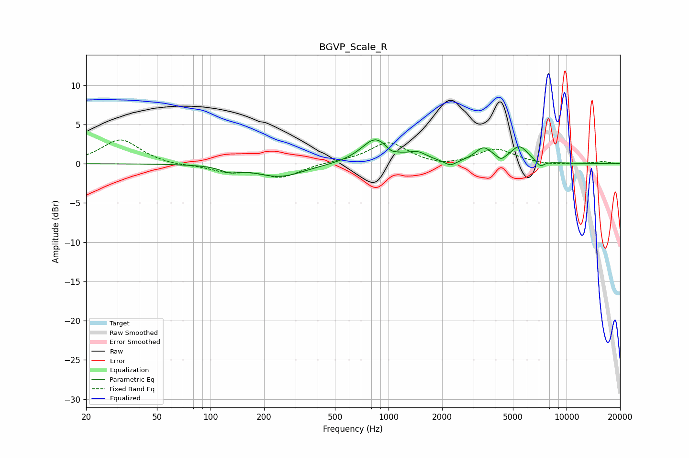

# BGVP_Scale_R
See [usage instructions](https://github.com/jaakkopasanen/AutoEq#usage) for more options and info.

### Parametric EQs
Apply preamp of -3.1 dB when using parametric equalizer.

|   # | Type    |   Fc (Hz) |    Q |   Gain (dB) |
|-----|---------|-----------|------|-------------|
|   1 | Peaking |       128 | 2.87 |        -0.7 |
|   2 | Peaking |       245 | 1.05 |        -1.7 |
|   3 | Peaking |       845 | 1.79 |         3.2 |
|   4 | Peaking |      1030 | 4.78 |        -0.5 |
|   5 | Peaking |      1458 | 2.63 |         1   |
|   6 | Peaking |      2228 | 4.29 |        -0.7 |
|   7 | Peaking |      3416 | 2.92 |         1.8 |
|   8 | Peaking |      4293 | 6    |        -0.6 |
|   9 | Peaking |      5438 | 2.89 |         2.1 |
|  10 | Peaking |      7136 | 6    |        -0.8 |

### Fixed Band EQs
When using fixed band (also called graphic) equalizer, apply preamp of **-3.1 dB** (if available) and set gains manually with these parameters.

|   # | Type    |   Fc (Hz) |    Q |   Gain (dB) |
|-----|---------|-----------|------|-------------|
|   1 | Peaking |        31 | 1.41 |         3.1 |
|   2 | Peaking |        62 | 1.41 |        -0.2 |
|   3 | Peaking |       125 | 1.41 |        -0.9 |
|   4 | Peaking |       250 | 1.41 |        -1.7 |
|   5 | Peaking |       500 | 1.41 |         0.2 |
|   6 | Peaking |      1000 | 1.41 |         2.7 |
|   7 | Peaking |      2000 | 1.41 |        -0.5 |
|   8 | Peaking |      4000 | 1.41 |         1.9 |
|   9 | Peaking |      8000 | 1.41 |        -0.2 |
|  10 | Peaking |     16000 | 1.41 |         0.3 |

### Graphs

