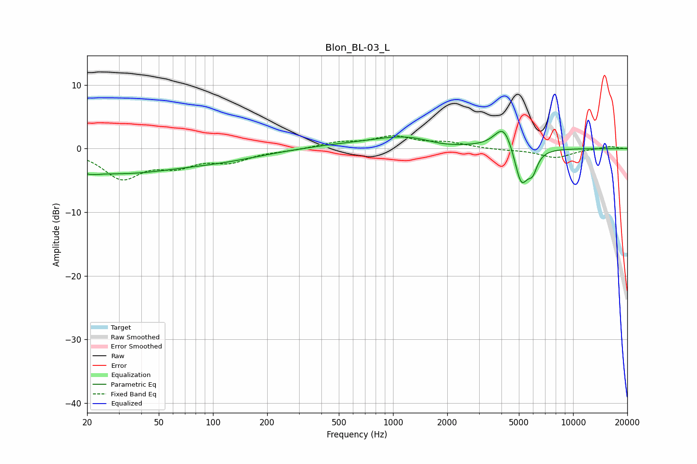

# Blon_BL-03_L
See [usage instructions](https://github.com/jaakkopasanen/AutoEq#usage) for more options and info.

### Parametric EQs
Apply preamp of -2.8 dB when using parametric equalizer.

|   # | Type    |   Fc (Hz) |    Q |   Gain (dB) |
|-----|---------|-----------|------|-------------|
|   1 | Peaking |        21 | 5.63 |        -3.6 |
|   2 | Peaking |        21 | 5.95 |         3.2 |
|   3 | Peaking |        28 | 0.38 |        -3.8 |
|   4 | Peaking |       118 | 0.61 |        -1.1 |
|   5 | Peaking |       479 | 0.66 |         0.5 |
|   6 | Peaking |      1175 | 0.76 |         1.8 |
|   7 | Peaking |      1863 | 1.44 |        -0.5 |
|   8 | Peaking |      4125 | 2.71 |         4   |
|   9 | Peaking |      5151 | 3.67 |        -6.1 |
|  10 | Peaking |      5956 | 5.22 |        -2.6 |

### Fixed Band EQs
When using fixed band (also called graphic) equalizer, apply preamp of **-2.1 dB** (if available) and set gains manually with these parameters.

|   # | Type    |   Fc (Hz) |    Q |   Gain (dB) |
|-----|---------|-----------|------|-------------|
|   1 | Peaking |        31 | 1.41 |        -4.4 |
|   2 | Peaking |        62 | 1.41 |        -2.3 |
|   3 | Peaking |       125 | 1.41 |        -1.8 |
|   4 | Peaking |       250 | 1.41 |        -0.2 |
|   5 | Peaking |       500 | 1.41 |         0.9 |
|   6 | Peaking |      1000 | 1.41 |         1.8 |
|   7 | Peaking |      2000 | 1.41 |         0.8 |
|   8 | Peaking |      4000 | 1.41 |        -0.2 |
|   9 | Peaking |      8000 | 1.41 |        -1.4 |
|  10 | Peaking |     16000 | 1.41 |         0.4 |

### Graphs

