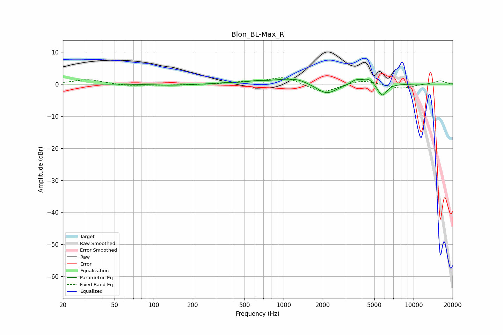

# Blon_BL-Max_R
See [usage instructions](https://github.com/jaakkopasanen/AutoEq#usage) for more options and info.

### Parametric EQs
Apply preamp of -1.6 dB when using parametric equalizer.

|   # | Type    |   Fc (Hz) |    Q |   Gain (dB) |
|-----|---------|-----------|------|-------------|
|   1 | Peaking |       137 | 1.01 |        -0.4 |
|   2 | Peaking |       349 | 2.23 |         0.3 |
|   3 | Peaking |       603 | 1.97 |         0.5 |
|   4 | Peaking |      1087 | 1.1  |         1.6 |
|   5 | Peaking |      1310 | 2.79 |         0.5 |
|   6 | Peaking |      2144 | 1.89 |        -3.3 |
|   7 | Peaking |      3563 | 4.26 |         1.1 |
|   8 | Peaking |      4525 | 2.48 |         2.4 |
|   9 | Peaking |      5391 | 3.06 |        -1.3 |
|  10 | Peaking |      5787 | 4.25 |        -3.1 |

### Fixed Band EQs
When using fixed band (also called graphic) equalizer, apply preamp of **-2.0 dB** (if available) and set gains manually with these parameters.

|   # | Type    |   Fc (Hz) |    Q |   Gain (dB) |
|-----|---------|-----------|------|-------------|
|   1 | Peaking |        31 | 1.41 |         1.4 |
|   2 | Peaking |        62 | 1.41 |        -0.6 |
|   3 | Peaking |       125 | 1.41 |        -0.3 |
|   4 | Peaking |       250 | 1.41 |        -0.1 |
|   5 | Peaking |       500 | 1.41 |         0.6 |
|   6 | Peaking |      1000 | 1.41 |         2.3 |
|   7 | Peaking |      2000 | 1.41 |        -2.8 |
|   8 | Peaking |      4000 | 1.41 |         1.4 |
|   9 | Peaking |      8000 | 1.41 |        -1.5 |
|  10 | Peaking |     16000 | 1.41 |         1.1 |

### Graphs

