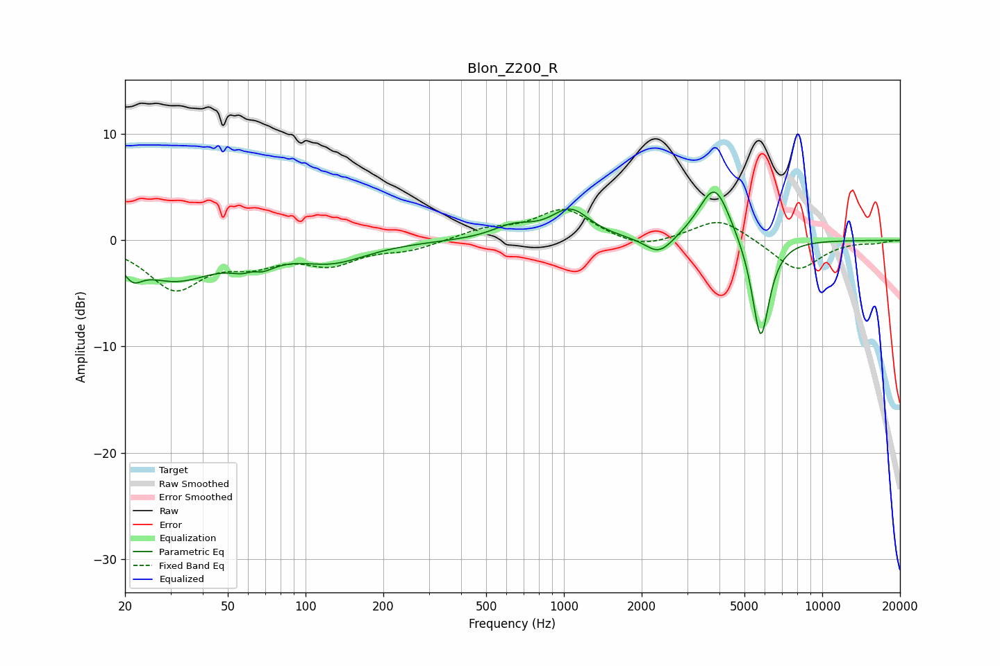

# Blon_Z200_R
See [usage instructions](https://github.com/jaakkopasanen/AutoEq#usage) for more options and info.

### Parametric EQs
Apply preamp of -4.6 dB when using parametric equalizer.

|   # | Type    |   Fc (Hz) |    Q |   Gain (dB) |
|-----|---------|-----------|------|-------------|
|   1 | Peaking |        21 | 4.05 |        -1.6 |
|   2 | Peaking |        31 | 0.92 |        -3.5 |
|   3 | Peaking |        62 | 3.87 |         1.8 |
|   4 | Peaking |        63 | 2.58 |        -3   |
|   5 | Peaking |       127 | 1.04 |        -1.8 |
|   6 | Peaking |       635 | 1.79 |         1.2 |
|   7 | Peaking |      1060 | 1.91 |         2.7 |
|   8 | Peaking |      2337 | 2.55 |        -1.8 |
|   9 | Peaking |      3833 | 2.27 |         5.5 |
|  10 | Peaking |      5777 | 4    |        -9.9 |

### Fixed Band EQs
When using fixed band (also called graphic) equalizer, apply preamp of **-3.0 dB** (if available) and set gains manually with these parameters.

|   # | Type    |   Fc (Hz) |    Q |   Gain (dB) |
|-----|---------|-----------|------|-------------|
|   1 | Peaking |        31 | 1.41 |        -4.4 |
|   2 | Peaking |        62 | 1.41 |        -1.7 |
|   3 | Peaking |       125 | 1.41 |        -2   |
|   4 | Peaking |       250 | 1.41 |        -0.8 |
|   5 | Peaking |       500 | 1.41 |         0.9 |
|   6 | Peaking |      1000 | 1.41 |         2.9 |
|   7 | Peaking |      2000 | 1.41 |        -1   |
|   8 | Peaking |      4000 | 1.41 |         2.1 |
|   9 | Peaking |      8000 | 1.41 |        -2.9 |
|  10 | Peaking |     16000 | 1.41 |        -0.2 |

### Graphs

