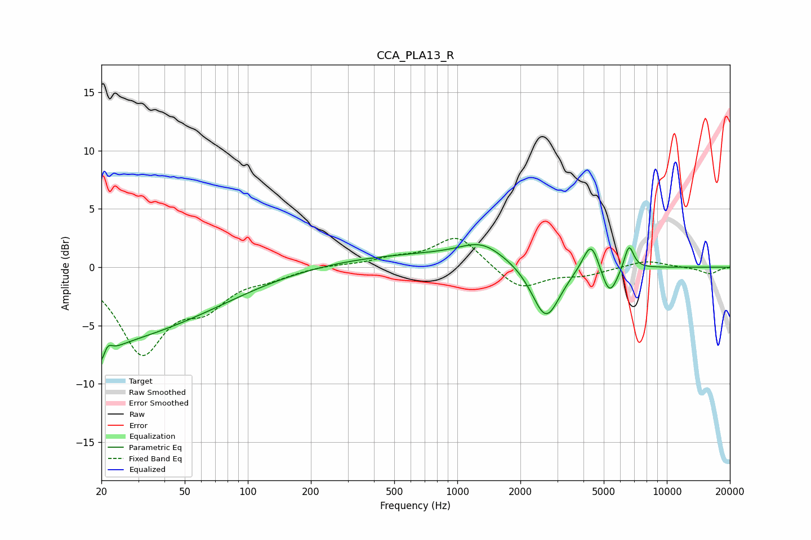

# CCA_PLA13_R
See [usage instructions](https://github.com/jaakkopasanen/AutoEq#usage) for more options and info.

### Parametric EQs
Apply preamp of -2.0 dB when using parametric equalizer.

|   # | Type    |   Fc (Hz) |    Q |   Gain (dB) |
|-----|---------|-----------|------|-------------|
|   1 | Peaking |        20 | 3.74 |        -5   |
|   2 | Peaking |        21 | 0.56 |        -4.4 |
|   3 | Peaking |        21 | 5.17 |         3.5 |
|   4 | Peaking |        50 | 0.46 |        -2.7 |
|   5 | Peaking |       762 | 0.28 |         1.1 |
|   6 | Peaking |      1304 | 1.39 |         1.3 |
|   7 | Peaking |      2648 | 2.06 |        -4.9 |
|   8 | Peaking |      4350 | 3.59 |         2.7 |
|   9 | Peaking |      5323 | 3.56 |        -2.6 |
|  10 | Peaking |      6595 | 6    |         2.2 |

### Fixed Band EQs
When using fixed band (also called graphic) equalizer, apply preamp of **-2.6 dB** (if available) and set gains manually with these parameters.

|   # | Type    |   Fc (Hz) |    Q |   Gain (dB) |
|-----|---------|-----------|------|-------------|
|   1 | Peaking |        31 | 1.41 |        -7   |
|   2 | Peaking |        62 | 1.41 |        -2.7 |
|   3 | Peaking |       125 | 1.41 |        -0.7 |
|   4 | Peaking |       250 | 1.41 |         0.2 |
|   5 | Peaking |       500 | 1.41 |         0.6 |
|   6 | Peaking |      1000 | 1.41 |         2.7 |
|   7 | Peaking |      2000 | 1.41 |        -2   |
|   8 | Peaking |      4000 | 1.41 |        -0.6 |
|   9 | Peaking |      8000 | 1.41 |         0.6 |
|  10 | Peaking |     16000 | 1.41 |        -0.6 |

### Graphs

