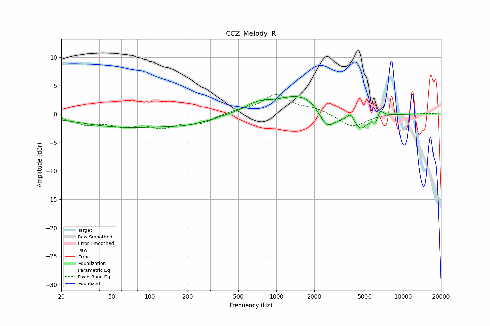

# CCZ_Melody_R
See [usage instructions](https://github.com/jaakkopasanen/AutoEq#usage) for more options and info.

### Parametric EQs
Apply preamp of -3.2 dB when using parametric equalizer.

|   # | Type    |   Fc (Hz) |    Q |   Gain (dB) |
|-----|---------|-----------|------|-------------|
|   1 | Peaking |        62 | 0.38 |        -2.2 |
|   2 | Peaking |       206 | 0.76 |        -1.1 |
|   3 | Peaking |       717 | 1.35 |         1.6 |
|   4 | Peaking |      1491 | 0.89 |         3.2 |
|   5 | Peaking |      1969 | 2.39 |         0.9 |
|   6 | Peaking |      2496 | 1.91 |        -3.6 |
|   7 | Peaking |      3866 | 6    |         1.2 |
|   8 | Peaking |      4652 | 2.57 |        -2.6 |
|   9 | Peaking |      6077 | 5.94 |        -1.3 |
|  10 | Peaking |      6630 | 5.97 |         1.4 |

### Fixed Band EQs
When using fixed band (also called graphic) equalizer, apply preamp of **-3.5 dB** (if available) and set gains manually with these parameters.

|   # | Type    |   Fc (Hz) |    Q |   Gain (dB) |
|-----|---------|-----------|------|-------------|
|   1 | Peaking |        31 | 1.41 |        -1.6 |
|   2 | Peaking |        62 | 1.41 |        -1.7 |
|   3 | Peaking |       125 | 1.41 |        -2   |
|   4 | Peaking |       250 | 1.41 |        -1.5 |
|   5 | Peaking |       500 | 1.41 |         0.6 |
|   6 | Peaking |      1000 | 1.41 |         3.3 |
|   7 | Peaking |      2000 | 1.41 |         0.9 |
|   8 | Peaking |      4000 | 1.41 |        -2.3 |
|   9 | Peaking |      8000 | 1.41 |         0.1 |
|  10 | Peaking |     16000 | 1.41 |         0.1 |

### Graphs

