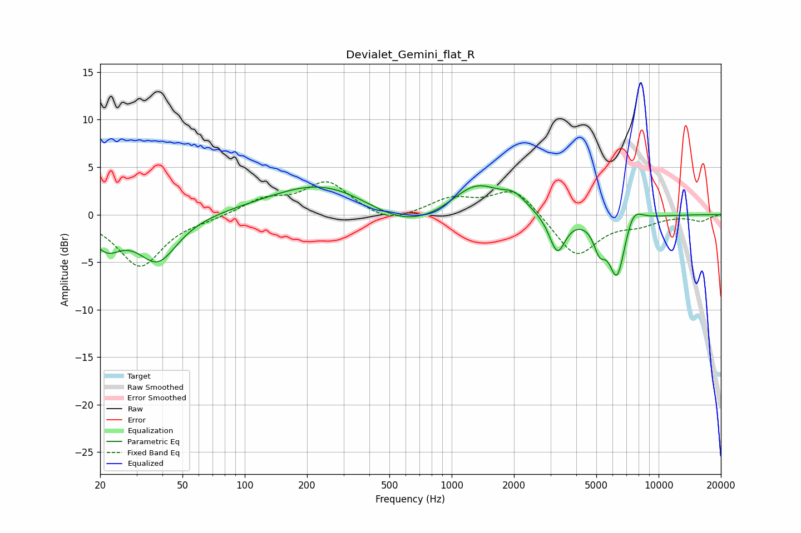

# Devialet_Gemini_flat_R
See [usage instructions](https://github.com/jaakkopasanen/AutoEq#usage) for more options and info.

### Parametric EQs
Apply preamp of -3.1 dB when using parametric equalizer.

|   # | Type    |   Fc (Hz) |    Q |   Gain (dB) |
|-----|---------|-----------|------|-------------|
|   1 | Peaking |        21 | 1.97 |        -3   |
|   2 | Peaking |        38 | 1.49 |        -4.8 |
|   3 | Peaking |       246 | 0.55 |         3.7 |
|   4 | Peaking |       594 | 0.68 |        -2.6 |
|   5 | Peaking |      1311 | 1.16 |         3.5 |
|   6 | Peaking |      2008 | 2.5  |         1.3 |
|   7 | Peaking |      3241 | 3.59 |        -4.1 |
|   8 | Peaking |      5180 | 4.85 |        -2.5 |
|   9 | Peaking |      6301 | 3.34 |        -6.6 |
|  10 | Peaking |      7525 | 3.19 |         2   |

### Fixed Band EQs
When using fixed band (also called graphic) equalizer, apply preamp of **-3.6 dB** (if available) and set gains manually with these parameters.

|   # | Type    |   Fc (Hz) |    Q |   Gain (dB) |
|-----|---------|-----------|------|-------------|
|   1 | Peaking |        31 | 1.41 |        -5.5 |
|   2 | Peaking |        62 | 1.41 |        -0.3 |
|   3 | Peaking |       125 | 1.41 |         1.5 |
|   4 | Peaking |       250 | 1.41 |         3.4 |
|   5 | Peaking |       500 | 1.41 |        -1.1 |
|   6 | Peaking |      1000 | 1.41 |         1.6 |
|   7 | Peaking |      2000 | 1.41 |         2.9 |
|   8 | Peaking |      4000 | 1.41 |        -4.5 |
|   9 | Peaking |      8000 | 1.41 |        -0.9 |
|  10 | Peaking |     16000 | 1.41 |        -0.6 |

### Graphs

