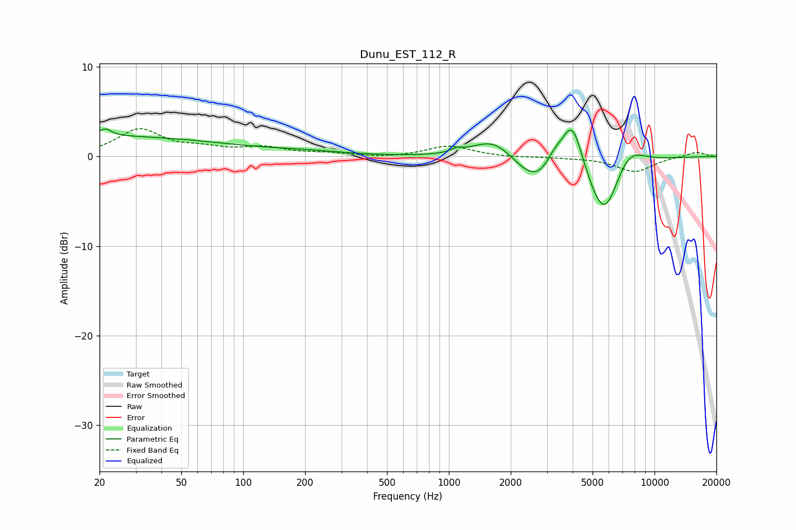

# Dunu_EST_112_R
See [usage instructions](https://github.com/jaakkopasanen/AutoEq#usage) for more options and info.

### Parametric EQs
Apply preamp of -3.2 dB when using parametric equalizer.

|   # | Type    |   Fc (Hz) |    Q |   Gain (dB) |
|-----|---------|-----------|------|-------------|
|   1 | Peaking |        20 | 0.22 |         2.2 |
|   2 | Peaking |        21 | 4.89 |         0.8 |
|   3 | Peaking |       199 | 0.73 |         0.4 |
|   4 | Peaking |      1095 | 5.01 |         0.4 |
|   5 | Peaking |      1677 | 1.27 |         3.1 |
|   6 | Peaking |      3239 | 1.04 |        -8.2 |
|   7 | Peaking |      3258 | 2.25 |         5   |
|   8 | Peaking |      3981 | 2.36 |         8.1 |
|   9 | Peaking |      5710 | 1.88 |        -6.3 |
|  10 | Peaking |      7403 | 1.7  |         2.8 |

### Fixed Band EQs
When using fixed band (also called graphic) equalizer, apply preamp of **-3.2 dB** (if available) and set gains manually with these parameters.

|   # | Type    |   Fc (Hz) |    Q |   Gain (dB) |
|-----|---------|-----------|------|-------------|
|   1 | Peaking |        31 | 1.41 |         2.9 |
|   2 | Peaking |        62 | 1.41 |         0.7 |
|   3 | Peaking |       125 | 1.41 |         0.9 |
|   4 | Peaking |       250 | 1.41 |         0.3 |
|   5 | Peaking |       500 | 1.41 |        -0.2 |
|   6 | Peaking |      1000 | 1.41 |         1.2 |
|   7 | Peaking |      2000 | 1.41 |        -0.1 |
|   8 | Peaking |      4000 | 1.41 |        -0.1 |
|   9 | Peaking |      8000 | 1.41 |        -1.7 |
|  10 | Peaking |     16000 | 1.41 |         0.5 |

### Graphs

